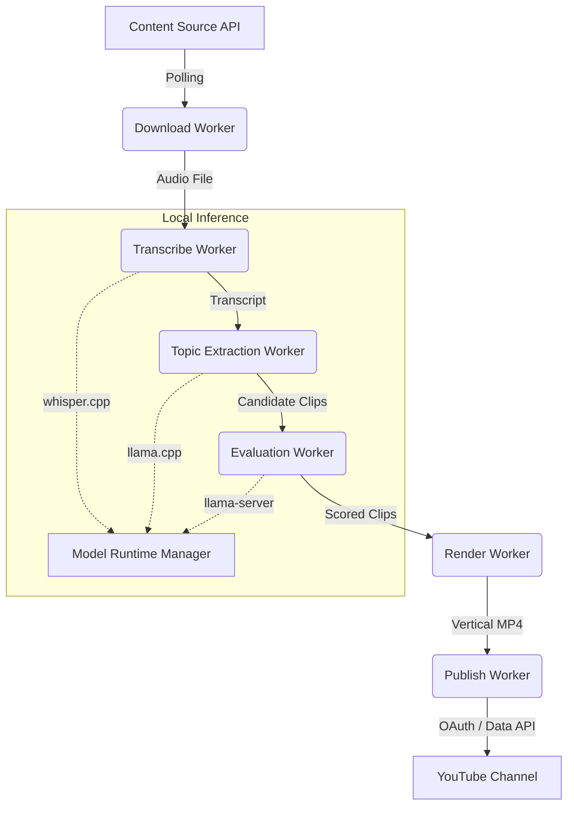

# Autonomous Media

An autonomous AI content production system that monitors channels, downloads media, extracts highlights using local LLMs, edits them into vertical Shorts, and publishes them to YouTube.

Designed specifically for a single-operator environment running on local hardware.

## Orientation

If you are new to this project, start by reading the [Technical Specification](docs/technical-specification.md) to understand the architecture, goals, and constraints.

### High-Level Architecture



## Quick Start

1. Install Python 3.11+.
2. Install `yt-dlp` and `ffmpeg` on your host system.
3. Clone the repository and set up the environment:
   ```bash
   python -m venv .venv
   .venv\Scripts\activate
   pip install -r requirements.txt
   ```
4. Start the background database and storage services:
   ```bash
   docker compose up -d
   ```
5. Apply database migrations:
   ```bash
   alembic upgrade head
   ```

## Documentation Map

- **[Technical Specification](docs/technical-specification.md)**: What this is and why it's built this way.
- **[Architecture](docs/architecture.md)**: High-level system overview and component interactions.
- **[Developer Guide](docs/developer-guide.md)**: How to build it and project structure.
- **[Runbook](docs/runbook.md)**: Incident response for production failures.
- **[ADRs](docs/adr/)**: Architectural Decision Records detailing major past decisions.
- **[Changelog](CHANGELOG.md)**: Release history.
- **[Contributing](CONTRIBUTING.md)**: Guidelines for tests and branching.
- **[Security](SECURITY.md)**: Vulnerability disclosure policy.
