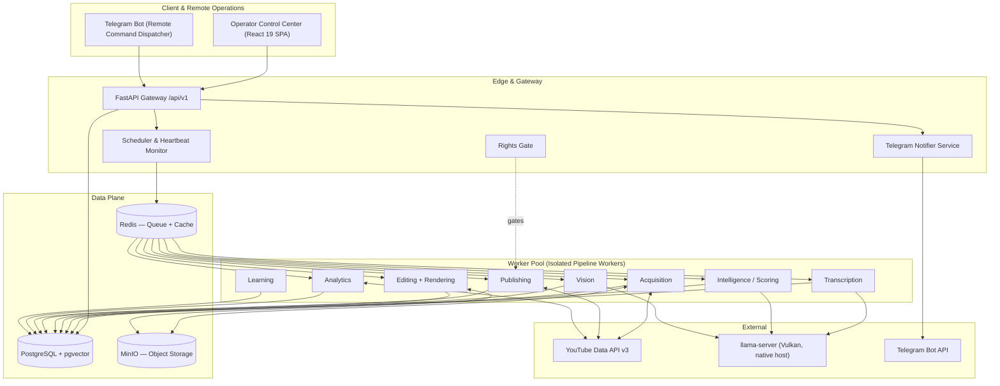
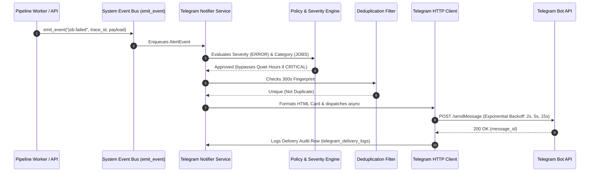
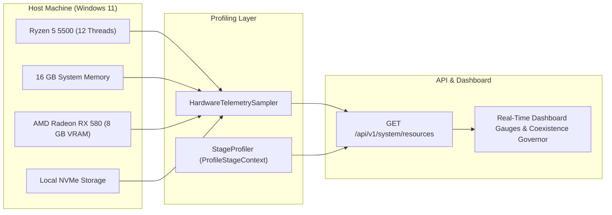
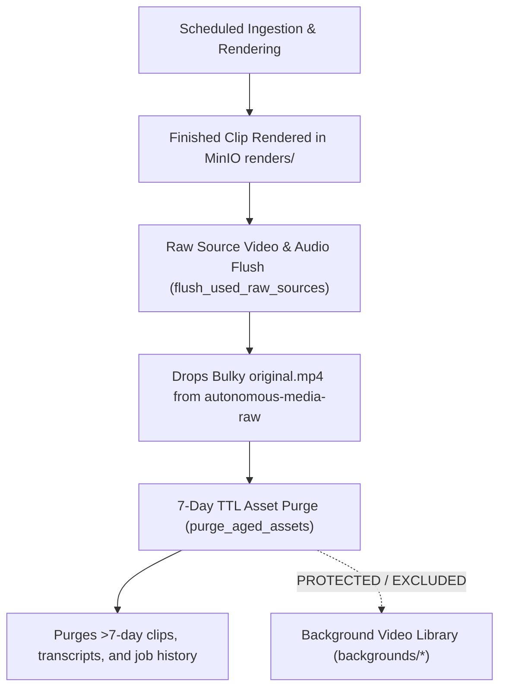

# System Architecture

> **Source of truth:** `docs/technical-specification.md`. This document provides a high-level architectural overview, data flows, and subsystem component specs.

---

## Architectural Style: Modular Monolith

YTAuto is a **modular monolith** — a single Python backend with strict internal module boundaries — plus genuinely separate **stateful services** (PostgreSQL, Redis, MinIO), a **native host process** for the AI model server (`llama-server`), and a **React 19 Single Page Application** control center.

---

## High-Level System Architecture

---

## Telegram Alert & Remote Operations Subsystem

The Telegram subsystem functions as the system's **remote command center and observability engine**.

### Key Subsystem Characteristics
1. **5-Level Severity Model**: `INFO`, `SUCCESS`, `WARNING`, `ERROR`, `CRITICAL`.
2. **Deduplication Filter**: 300-second fingerprinting window (`event_type:stage:entity_id:error_hash`).
3. **Incident Correlation**: Suppresses individual alerts when 5+ failures occur in 10 minutes, emitting a single `🚨 PIPELINE INCIDENT DETECTED` card, followed by `🟢 SYSTEM RECOVERED` when resolved.
4. **Non-Blocking Execution**: Notifications process asynchronously inside `telegram_notifier_queue`. Network timeouts or Telegram errors **never block video workers**.
5. **Bot Commands**: Remote command dispatcher handling `/status`, `/jobs`, `/failed`, `/review`, `/quota`, `/health`, and `/help` with Chat ID allowlist authorization.

---

## Data Design Summary

All **large content** (raw transcripts as timestamped JSON, rendered MP4s, audio extracts) lives in **MinIO**. PostgreSQL holds metadata and pointers.

### PostgreSQL Core Tables

| Table | Purpose |
|---|---|
| `channels` | One row per channel; all config as data, never as code |
| `content_sources` | Plugin-pattern source registry per channel |
| `source_videos` | Downloaded video metadata + MinIO `storage_key` |
| `source_posts` | Submitted Reddit text narrative stories |
| `transcripts` | ASR metadata — `engine`, `language`, `storage_key` → MinIO |
| `clip_candidates` | Scored candidate windows (`start_ms`/`end_ms`) |
| `clips` | Rendered artifact metadata + `channel_id`, `thumbnail_key` |
| `background_assets` | Footage library metadata (`storage_key`, `license_type`) |
| `inventory_items` | Production/publishing decoupling layer |
| `rights_records` | Per-source rights status — `owned`/`licensed`/`permission_granted`/`unknown`/`denied` |
| `analytics_snapshots` | Time series per `inventory_item_id` |
| `jobs` | State machine rows — `type`, `status`, `last_heartbeat_at` |
| `telegram_configs` | Persistent Telegram bot token, chat_id, category policies, quiet hours |
| `telegram_delivery_logs` | Audit trail of all sent, failed, or suppressed Telegram alerts |
| `system_events` | Append-only audit + event log with `trace_id` |

---

## Hardware Observability & Stage Profiling Subsystem

### Key Capabilities
1. **Host Telemetry**: Continuous measurement of host CPU utilization %, RAM used/free headroom in GB, dedicated GPU VRAM (via Windows Performance Counters), and storage footprints.
2. **Coexistence Governor**: Automated evaluation of available host memory emitting `optimal`, `contended`, or `critical` state to prevent concurrent workload crashes (e.g. OpenWorker).
3. **Stage Execution Profiling**: Transparent context manager (`ProfileStageContext`) wrapped around worker `process()` calls in `base.py` recording execution latency, peak RAM/VRAM deltas, and LLM token throughput without modifying worker stage logic.

---

## Storage Lifecycle & Retention Engine

### Storage Retention Policies
1. **Immediate Raw Source Flush (`POST /api/v1/system/storage/flush-raw`)**: Drops completed raw source MP4s and extracted WAVs once all derived clips have finished rendering.
2. **7-Day Aged Asset Retention (`POST /api/v1/system/storage/purge-aged?days=7`)**: Drops rendered clips, subtitles, and job logs older than 7 days from MinIO and Postgres.
3. **Strict Background Protection**: Background video assets (`background_assets` / `backgrounds/*`) are permanently protected from automated TTL flushes.

