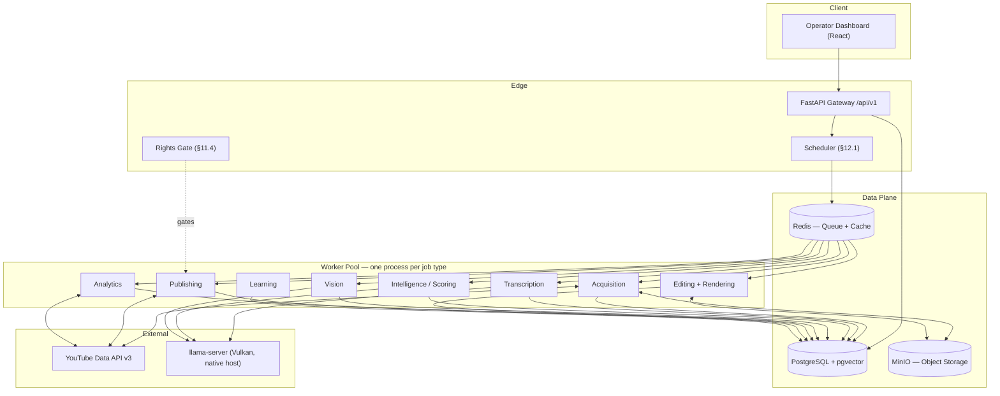
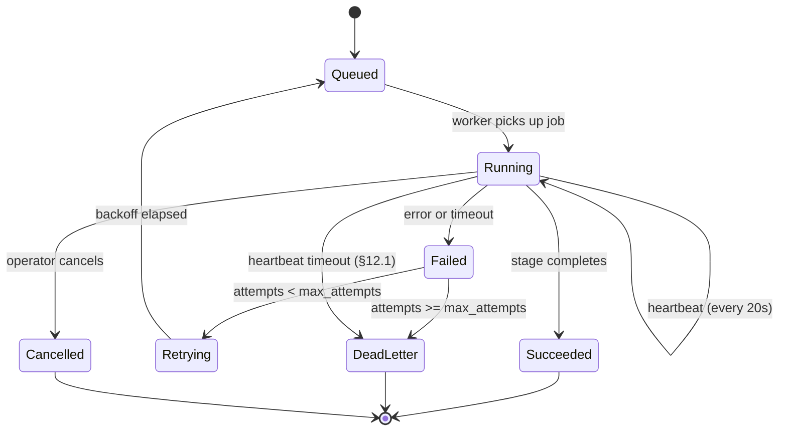
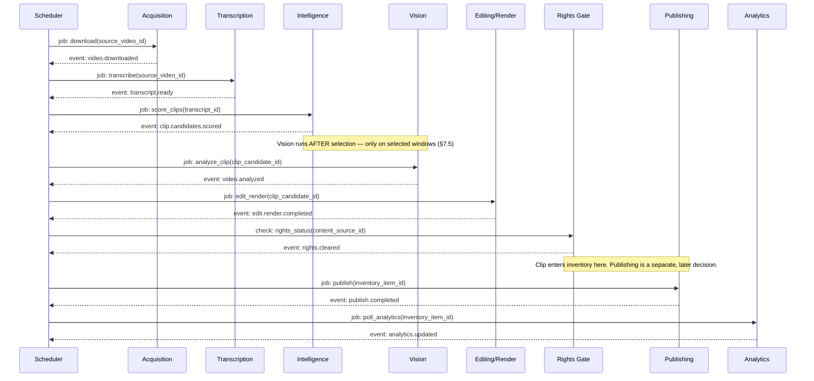

# System Architecture

> **Source of truth:** `docs/technical-specification.md` (v1.2). This document is a navigable summary; it does not repeat every decision rationale — those live in the ADRs and the spec itself.

---

## Architectural Style: Modular Monolith

Autonomous Media V1 is a **modular monolith** — one Python codebase with strict internal module boundaries — plus genuinely separate **stateful services** (PostgreSQL, Redis, MinIO) and a **native host process** for the AI model server. See [ADR 0001](adr/0001-modular-monolith-over-microservices.md).

This is the correct trade-off for a single operator on one machine: function calls instead of network hops between "engines", a single deployable, and no team boundary that would justify the overhead of true microservices. Full service extraction is deferred to V4/V5.

---

## Five Non-Negotiable Principles

1. **Channels submit jobs; they do not own pipelines.** All channels share one processing pipeline. Adding channel four is a data change, not a re-architecture.
2. **Production is decoupled from publishing.** Clips render into an inventory continuously; a separate rules-driven engine decides what ships and when — absorbing quota limits and source droughts without stalling the factory.
3. **Content sourcing is a plugin, not a hard-coded assumption.** `YouTubeClipSource` is the first implementation of a `ContentSource` interface. AI-generated stories and RSS feeds are later implementations of the same interface.
4. **Every third-party input carries an enforced rights status.** No clip reaches a publish queue with `unknown` or `denied` rights without an explicit, audit-logged manual override.
5. **The AI layer is a bounded pipeline of scoped model calls, not an autonomous swarm.** Deterministic job pipeline, auditable LLM calls at specific stages, clear fallback tiers.

---

## High-Level Architecture



---

## Job Lifecycle (State Machine — spec §7.4)



**Heartbeat mechanism (spec §12.1):** each worker updates `jobs.last_heartbeat_at` every 20 seconds. The Scheduler's poll loop independently detects `running` jobs whose heartbeat is stale and requeues them — making Windows reboots and silent process crashes self-healing retries rather than permanently stuck jobs.

---

## End-to-End Pipeline Sequence



---

## Data Design Summary

All **large content** (raw transcripts as timestamped JSON, rendered MP4s, audio extracts) lives in **MinIO**. PostgreSQL holds only metadata and pointers. See spec §8.1–§8.5.

### MinIO Object Layout

```
raw/{source_video_id}/original.mp4
raw/{source_video_id}/audio.wav
transcripts/{transcript_id}.json       ← full word-level timestamped JSON
renders/{clip_id}/final.mp4
renders/{clip_id}/thumbnail.jpg
branding/{channel_slug}/logo.png
branding/{channel_slug}/outro.mp4
```

### PostgreSQL Tables (spec §8.3)

| Table | Purpose |
|---|---|
| `channels` | One row per channel; all config as data, never as code |
| `content_sources` | Plugin-pattern source registry per channel |
| `source_videos` | Downloaded video metadata + MinIO `storage_key` |
| `transcripts` | ASR metadata only — `engine`, `language`, `word_count`, `storage_key` → MinIO |
| `topics` | pgvector embeddings for novelty/dedup (spec §11.2) |
| `clip_candidates` | Scored candidate windows (`start_ms`/`end_ms` — millisecond precision) |
| `clips` | Rendered artifact metadata + `channel_id`, `thumbnail_key` |
| `inventory_items` | Production/publishing decoupling layer (spec §11.4) |
| `rights_records` | Per-source rights status — `owned`/`licensed`/`permission_granted`/`unknown`/`denied` |
| `analytics_snapshots` | Time series per `inventory_item_id` — never overwritten |
| `jobs` | State machine rows — `.type`, `.status`, `last_heartbeat_at` |
| `models` | Model registry for Runtime Manager |
| `eval_runs` | Evaluation pass records for the promotion gate (spec §18.1) |
| `system_events` | Append-only audit + event log, every row carries `trace_id` |

### Key Indexes (spec §8.4)

- `jobs (status, priority, created_at)` — primary queue-poll query
- `source_videos (content_source_id, published_at)` — recency lookups
- `inventory_items (channel_id, status, scheduled_at)` — publishing engine
- `clip_candidates (source_video_id, rank)` — top-K selection
- `topics.embedding` — ivfflat/hnsw ANN via pgvector
- `analytics_snapshots (inventory_item_id, captured_at)` — retention curves
- `system_events (trace_id)` — lifecycle reconstruction

---

## Infrastructure

### Services

| Service | How it runs | Purpose |
|---|---|---|
| PostgreSQL + pgvector | Docker (via `docker-compose.yml`) | Primary state store |
| Redis | Docker | Job queue + response cache |
| MinIO | Docker | Object storage (S3-compatible) |
| FastAPI | Docker or native | REST API gateway |
| Dashboard | Docker or native dev server | Operator UI |
| `llama-server` (Vulkan) | **Native Windows host** | LLM inference — GPU passthrough not used |

### Why the Model Server is Native (not in Docker)

The AMD RX 580 (Polaris/GCN4) has no ROCm support on any OS as of ROCm 7.2. Docker GPU passthrough for this card is also unsupported. The working path is a **Vulkan-compiled `llama.cpp`/`llama-server`** running natively on the Windows host. Containerised workers reach it at `http://host.docker.internal:<port>`. See [ADR 0002](adr/0002-vulkan-over-rocm.md) and [ADR 0006](adr/0006-http-llama-server.md).

### Hardware Upgrade Path (spec §13.5)

| Upgrade | Unlocks |
|---|---|
| 16 → 32 GB RAM | `model_residency: eager` — no per-stage load/unload |
| NVIDIA GPU | CUDA across all frameworks, fastest inference path |
| 32 → 64 GB RAM | `processing.mode: parallel`, concurrent workers |

---

## AI Layer

### Model Stack (spec §25.4)

| Task | Model | Runtime |
|---|---|---|
| Clip scoring, titles, descriptions | Qwen 3 8B Instruct (Q4_K_M) | Vulkan llama-server |
| Speech recognition | Whisper Large-v3 Turbo | faster-whisper |
| Vision / speaker tracking / OCR | Qwen2.5-VL 7B | Vulkan llama-server |
| Face/pose tracking | MediaPipe | CPU |
| Speaker diarization | pyannote.audio | CPU/GPU |
| Voice activity detection | Silero VAD | CPU |
| Video encode/decode | FFmpeg (AMF/VCE hardware) | GPU fixed-function |

### StageModelManager (spec §12.9)

Every AI-dependent worker routes through `runtime/manager.py::StageModelManager` — the single place owning model swap/load, per-model timeout, retry-at-lower-temperature, two-tier fallback (primary → fallback → dead-letter), and health checks. Workers never call the model server directly.

```
Model swap sequence (residency_mode = "swap"):
  Scheduler dispatches job
  → StageModelManager._unload_previous()   [tell llama-server to drop current weights]
  → StageModelManager.load(next_model)     [tell llama-server to load next model]
  → Worker.process() calls run_stage()
  → _infer_with_retry() [up to 2 attempts at lower temperature]
  → on failure: fallback model → on fallback failure: StageUnrecoverableError → dead_letter
```

### Scoring Pipeline Efficiency (spec §11.1, §20.3)

Two-stage cascade:
1. **Cheap heuristics per candidate** (hook detection, speaker dynamics, audio events) — no model call.
2. **Batched LLM scoring** — up to 15 candidates per call, amortising the shared system prompt and channel profile tokens across the whole shortlist rather than repeating them per candidate.

Novelty check via pgvector `topics.embedding` ANN search prevents topic repetition across published clips (spec §11.2).

---

## Rights & Compliance (spec §11.4)

Every `content_source` has a `rights_records` row. A clip inherits its source's status. The `RightsGate` blocks publishing unless status is `owned`, `licensed`, or `permission_granted`. Every status change is audit-logged to `system_events` with operator identity and evidence reference. `fair_use_asserted` is deliberately **not** a valid status — fair use is a legal judgment, not a software checkbox.

---

## Scaling (spec §19)

The Scheduler's dispatch loop is literally `for channel in channels: enqueue_jobs(channel)`. Adding channel 4 through channel 30 is adding rows to `channels`/`content_sources`. No code changes. Concurrency is controlled by `workers.max_concurrent_jobs` (config value, not a code path).

| Stage | `processing.mode` | `max_concurrent_jobs` | Hardware required |
|---|---|---|---|
| V1 (now) | `sequential` | 1 | Current |
| +RAM | `sequential` | 1–2 | 32 GB |
| +GPU | `sequential`, faster | 1–2 | 32 GB + NVIDIA |
| +RAM again | `parallel` | 4+ | 64 GB |
