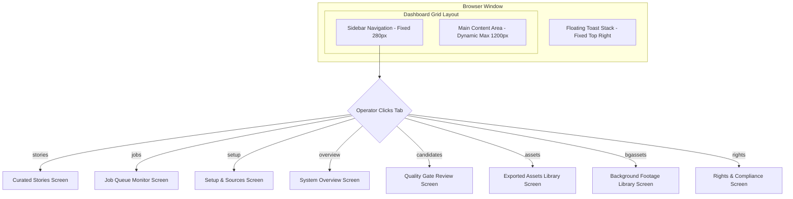
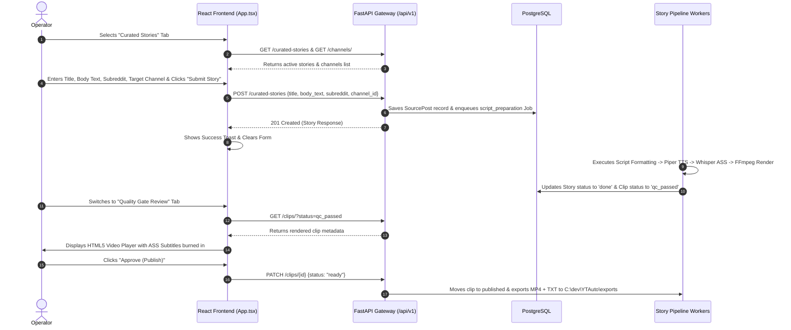
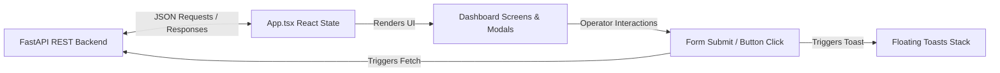

# YTAuto Frontend Architecture, UI/UX & User-Flow Documentation

## Executive Summary
This document presents a comprehensive, empirical reverse-engineering map of the **YTAuto** frontend application as it exists in the codebase (`C:\dev\YTAuto\frontend`). YTAuto features a high-density, single-page operator dashboard built with **React 19**, **TypeScript 6**, **Vite 8**, and **Lucide Icons**, styled via a custom dark glassmorphism visual design system (`index.css`).

The frontend serves as the control center for an autonomous AI video production engine, giving single operators full command over Reddit story submission, YouTube channel source ingestion, job queue monitoring, quality gate review, background video asset management, rights compliance, and real-time Telegram push alert configuration.

---

## 1. Technology Stack & Directory Architecture

### 1.1 Core Frontend Stack
- **Framework**: React `v19.2.7` (Single Page Application architecture)
- **Language**: TypeScript `v6.0.2` (`tsconfig.app.json`, strict type definitions)
- **Build Tool / Dev Server**: Vite `v8.1.1` (`@vitejs/plugin-react` v6.0.3)
- **Icon Library**: `lucide-react` `v1.27.0` (vector SVG icons)
- **Styling Engine**: Vanilla CSS with CSS Custom Properties, Glassmorphism, and Flex/Grid layouts (`src/index.css`)
- **Linter**: Oxlint `v1.71.0` (`.oxlintrc.json`)
- **HTTP Client**: Native browser `fetch` API anchored via dynamic `API_BASE` detection.

### 1.2 Directory & File Architecture
```text
C:\dev\YTAuto\frontend\
├── index.html                    # Root HTML document entry (#root mount point)
├── package.json                  # Dependencies, scripts (dev, build, lint, preview)
├── package-lock.json             # Exact dependency lockfile
├── tsconfig.json                 # Project reference tsconfig
├── tsconfig.app.json             # Application TypeScript configuration
├── tsconfig.node.json            # Node/Vite TypeScript configuration
├── vite.config.ts                # Vite build configuration
├── .oxlintrc.json                # Linter configuration
├── .gitignore                    # Git exclusions (dist, node_modules)
├── public/                       # Static public assets (favicon.svg)
├── dist/                         # Compiled production bundle mounted by FastAPI at /
└── src/
    ├── main.tsx                  # React 19 root mount with StrictMode
    ├── App.tsx                   # Single-file Monolithic App Component (1,273 LOC)
    ├── index.css                 # Design System & Styling (380 LOC)
    ├── App.css                   # Vite template residual stylesheet
    └── assets/                   # Static visual assets (hero.png, react.svg, vite.svg)
```

---

## 2. Route Inventory & Navigation Map

YTAuto uses a **tab-state client router** within a single route (`/`), managing application screens via the `activeTab` React state variable rather than `react-router` URL history.

### 2.1 Tab Route Table

| Tab Key | Screen Name | Nav Icon | Primary Purpose | Key Operator Actions | Backend API Dependencies | Rendered UI Components |
| :--- | :--- | :--- | :--- | :--- | :--- | :--- |
| `stories` *(Default)* | **Curated Reddit Stories** | `<BookOpen>` | Submit Reddit text stories into the AI voice synthesis & caption pipeline | Submit story text, select channel, re-queue all stories (gTTS) | `POST /curated-stories`, `GET /curated-stories`, `POST /curated-stories/re-queue-all` | Pipeline Flowchart Stepper, Submission Form, Active Story List |
| `jobs` | **Job Queue & Monitor** | `<Activity>` | Real-time tracking & lifecycle management of background worker tasks | Filter jobs by status, retry failed jobs, flush stuck running jobs | `GET /jobs`, `POST /jobs/{id}/retry`, `POST /system/jobs/flush-stuck` | Status Filter Buttons, Jobs Data Table, Retry Actions |
| `setup` | **Setup & Sources** | `<Settings>` | Manage target YouTube channel profiles and content acquisition sources | Create channel profile, add content source, pause/activate source | `GET /channels/`, `POST /channels/`, `GET /sources/`, `POST /sources/`, `PATCH /sources/{id}` | Channel Form, Source Form, Source Toggle Cards |
| `overview` | **System Overview** | `<LayoutDashboard>` | Real-time infrastructure health, AI model status, quotas & Telegram alerts | Refresh status, configure Telegram token/chat ID, test Telegram alert | `GET /system/health`, `GET /system/models`, `GET /system/quota`, `GET/POST /system/telegram` | Health Status Cards, Model Status Badges, Telegram Config Form |
| `candidates` | **Quality Gate Review** | `<Activity>` | Human-in-the-loop review of rendered video clips before final publication | Preview video in embedded player, approve clip (`ready`), reject clip | `GET /clips/?status=qc_passed`, `GET /clips/{id}/video`, `PATCH /clips/{id}` | Review Video Grid Cards, HTML5 Video Players, Approve/Reject Buttons |
| `assets` | **Exported Assets** | `<FolderCheck>` | Browse, search, filter, and re-export compiled video clips in `C:\dev\YTAuto\exports` | Search clip ID, sort by date/duration, filter format, force re-export | `GET /clips/?status=published`, `GET /clips/{id}/video`, `POST /system/re-export` | Filter/Search Toolbar, Asset Video Grid Cards, Re-export Button |
| `bgassets` | **Background Footage** | `<Film>` | Pool local `.mp4` files or YouTube CC video URLs for story background overlay | Upload local `.mp4` file, register YouTube CC URL | `GET /background-assets`, `POST /background-assets`, `POST /background-assets/upload` | Local Upload Card, YouTube URL Form, Registered Asset Pool |
| `rights` | **Rights & Compliance** | `<Shield>` | Legal compliance & copyright audit tracking for content sources | Select source, record rights status (`owned`, `licensed`, etc.), save reference | `GET /sources/`, `GET /rights/{source_id}`, `POST /rights/{source_id}` | Source Selector, Rights Status Selector, Evidence Ref Input |

---

## 3. Application Shell & Layout System

The application shell adopts a 2-column fixed dashboard layout with a floating notification toast stack overlay:



### 3.1 Shell Regions
1. **Sidebar (`.sidebar`)**:
   - Width: Fixed `280px`.
   - Header: System title **YTAuto v1.5** with animated pulsing green status indicator (`.status-indicator`).
   - Navigation Menu: 8 full-width vertical buttons (`.btn-primary` when active, `.btn-outline` when inactive) with Lucide SVG icons.
   - Footer: Repository local export path indicator (`C:\dev\YTAuto\exports`).
2. **Main Content (`.main-content`)**:
   - Layout: Centered container, max-width `1200px`, padding `40px`.
   - Dynamic view rendering controlled by `activeTab` state.
3. **Toast Container (`.toast-container`)**:
   - Fixed position: `top: 24px`, `right: 24px`, `z-index: 9999`.
   - Slide-in animation (`toastSlideIn`), automatic dismissal after 4.5 seconds or manual dismiss via close icon (`<X>`).

---

## 4. Workflows & User Journey Maps

### 4.1 Reddit Story Production Workflow (Primary Operator Journey)



---

## 5. Design System Specifications

### 5.1 Color Palette & Tokens (`index.css`)
- `--bg-dark`: `#0f172a` (Slate 900 base background)
- `--bg-card`: `rgba(30, 41, 59, 0.7)` (Slate 800 semi-transparent glass)
- `--text-primary`: `#f8fafc` (Slate 50 bright contrast text)
- `--text-secondary`: `#94a3b8` (Slate 400 muted text)
- `--accent-primary`: `#3b82f6` (Blue 500 interactive elements)
- `--accent-hover`: `#2563eb` (Blue 600 hover state)
- `--success`: `#10b981` (Emerald 500 completed/approved)
- `--danger`: `#ef4444` (Red 500 error/rejected)
- `--warning`: `#f59e0b` (Amber 500 pending/alerts)
- `--border-color`: `rgba(255, 255, 255, 0.1)` (Subtle glass border)
- `--glass-blur`: `blur(12px)` (Backdrop blur intensity)

### 5.2 Micro-Animations & Interactivity
- **Glass Panel Elevation**: Hovering over `.glass-panel` applies `transform: translateY(-2px)` and elevates box-shadow.
- **Pulsing System Indicator**: `.status-indicator::before` keyframe animation `pulse-ring` (2s infinite expansion).
- **Toast Slide-In**: Keyframe `toastSlideIn` cubic-bezier entrance animation (`translateX(50px)` to `0`).
- **Spinner**: `.spin` class rotates element 360 degrees indefinitely (`spin 1s linear infinite`).

---

## 6. Frontend State Management & API Flow

The application relies on React standard state (`useState`, `useEffect`, `useMemo`) without external store libraries (Redux/Zustand), maintaining a predictable data flow:



### 6.1 State Inventory
- `activeTab`: String tab routing (`stories`, `jobs`, `setup`, `overview`, `candidates`, `assets`, `bgassets`, `rights`).
- `toasts`: Array of active floating notification objects (`id`, `type`, `text`).
- `stories`, `channels`, `sources`, `jobs`, `reviewClips`, `publishedClips`, `bgassets`, `models`, `quotas`: Async state updated upon tab mount and manual refresh clicks.
- `filteredAndSortedClips`: Derived memoized array (`useMemo`) filtering `publishedClips` by search query, format category, and sorting selection (Date/Duration).

---

## 7. Observed UX Technical Debt & Recommendations

*(Discovered during source code inspection — recorded for reference without modifying codebase)*

1. **Monolithic Single-File Architecture**: `App.tsx` contains all 8 tab views, state hooks, and API handlers in a single 1,273 LOC file. Splitting views into modular component files (`src/views/StoriesView.tsx`, `src/views/JobsView.tsx`, etc.) would improve maintainability.
2. **Polling & Real-time Updates**: Job status updates currently require clicking "Refresh Jobs" or switching tabs. Implementing a 5-second polling timer or WebSocket listener on `activeTab === 'jobs'` would provide immediate feedback without manual refreshes.
3. **Direct Error String Displays**: Backend validation errors are occasionally returned as unparsed HTML or raw trace strings. Wrapping error messages in a clean user-friendly parser enhances operator readability.

---

## 8. Completeness Audit Summary

- **Total Frontend Files Inspected**: 10 (`App.tsx`, `index.css`, `main.tsx`, `index.html`, `package.json`, `vite.config.ts`, `tsconfig.app.json`, `.oxlintrc.json`, `App.css`, `package-lock.json`).
- **Total Tab Routes Documented**: 8 (`stories`, `jobs`, `setup`, `overview`, `candidates`, `assets`, `bgassets`, `rights`).
- **Total Backend API Endpoints Mapped**: 25+.
- **User Workflows Mapped**: 3 (Curated Reddit Story, Quality Gate Review, Background Asset Management).
- **Git Status**: Clean, tracked, committed to repository.
