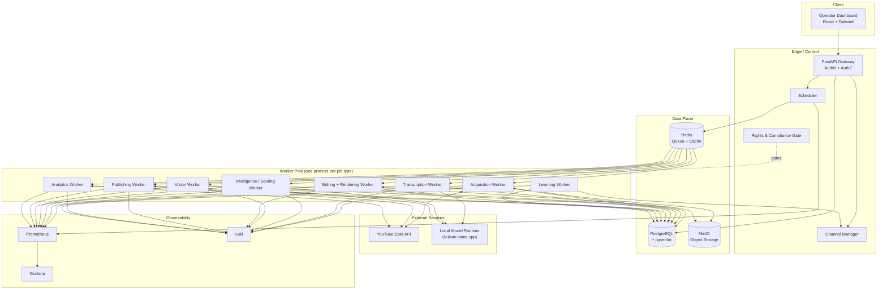
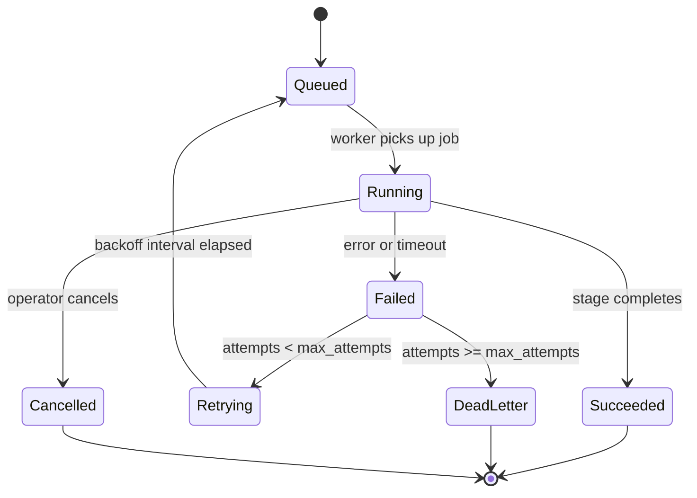
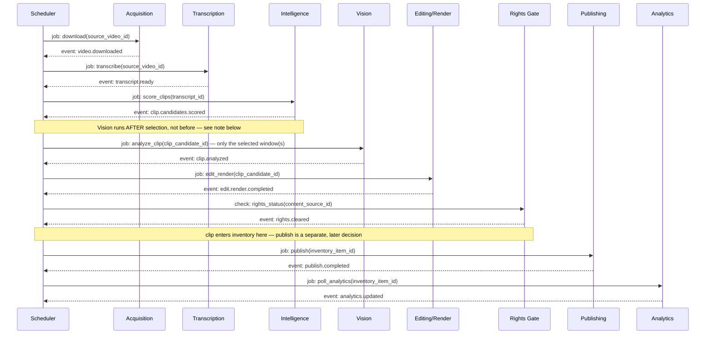
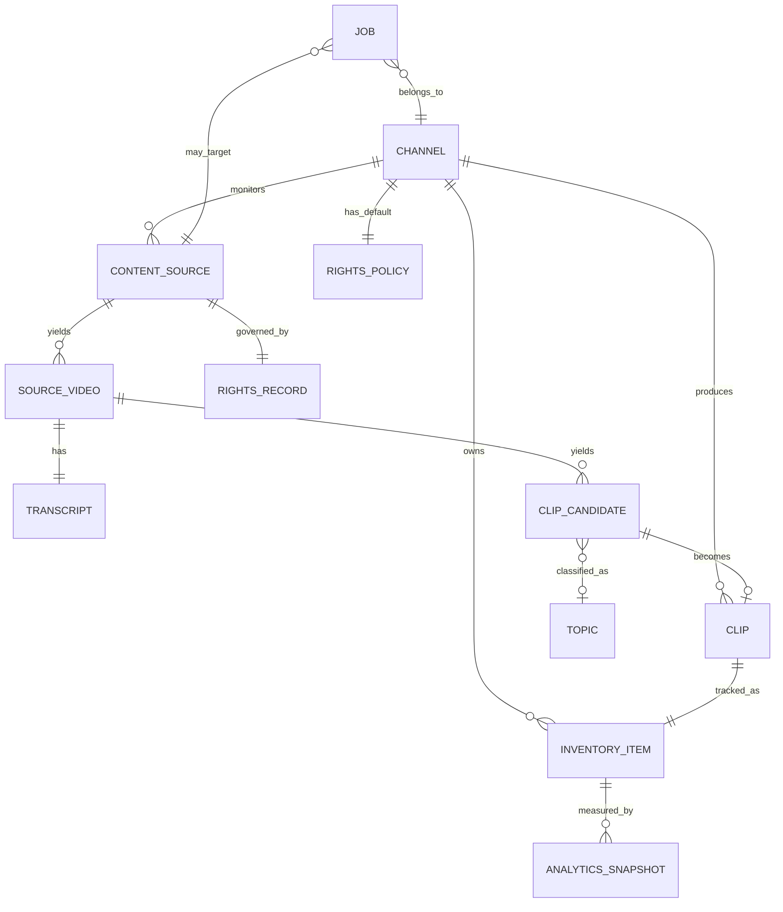

# Autonomous Media

## Technical Specification & System Design

**Version:** 1.2
**Status:** Draft for Implementation
**Classification:** Internal — Single-Operator System
**Last Updated:** July 25, 2026
**Document Owner:** Project Operator

---

### Revision History

| Version | Date | Change |
|---|---|---|
| 0.1 – 0.9 | (informal) | Iterative discovery conversation: feasibility, architecture sketches, hardware assessment, scope narrowing, vision document, draft SRS |
| 1.0 | 2026-07-25 | First consolidated technical specification. Formalizes project name as **Autonomous Media**, resolves open contradictions from the discovery phase, and closes gaps in quota planning, rights/compliance, data model, API design, and hardware-specific AI runtime strategy |
| 1.1 | 2026-07-25 | Review pass closed six remaining gaps: a concrete AI evaluation framework with a promotion gate (§18.1), a fully specified Model Runtime Manager covering fallback/quantization/timeout/retry/health-check/caching/memory accounting (§13.9), a formal configuration schema (§25.6), a comparative model benchmark table (§25.7), a versioned prompt library (§25.8), and a benchmark-dataset specification (§25.9). Considered and deliberately deferred: splitting into separate PRD/SAD/Engineering-Spec documents — reasonable once implementation exists to organize around, premature before Phase 0 does |
| 1.2 | 2026-07-25 | External review pass (10 recommendations, all adopted): heartbeat mechanism for stuck jobs (§12.1, §8.3), removed `fair_use_asserted` as a machine-enforced status — fair use now routes only through the manual override path (§8.3, §11.4), added `project_id` for per-channel quota pools (§8.3, §5.1, §25.6), specified a single persistent model-server process rather than restart-per-stage (§13.3), added a concrete 2-hour-podcast benchmark protocol to NFR-3, reordered Vision after Intelligence so it only processes selected clip windows (§7.5, §12.5), batched candidate scoring into one LLM call per shortlist instead of one call per candidate (§11.1, §20.3), split the benchmark set into a 40-episode development slice and a 10-episode hold-out slice never used for tuning (§18.1, §25.9), added `quota_priority` for channels sharing a project (§25.6, §11.4), and documented `host.docker.internal` for containerized workers reaching the native host model server (§13.4) |

---

## Table of Contents

1. [Executive Summary](#1-executive-summary)
2. [Problem Statement](#2-problem-statement)
3. [Goals](#3-goals)
4. [Non-Goals](#4-non-goals-v1)
5. [Functional Requirements](#5-functional-requirements)
6. [Non-Functional Requirements](#6-non-functional-requirements)
7. [Complete Architecture](#7-complete-architecture)
8. [Data Design](#8-data-design)
9. [API Design](#9-api-design)
10. [User Flows](#10-user-flows)
11. [Business Logic](#11-business-logic)
12. [Component Specifications](#12-component-specifications)
13. [Infrastructure](#13-infrastructure)
14. [Security](#14-security)
15. [Deployment](#15-deployment)
16. [Monitoring](#16-monitoring)
17. [Logging](#17-logging)
18. [Testing](#18-testing)
19. [Scaling Strategy](#19-scaling-strategy)
20. [Performance Optimization](#20-performance-optimization)
21. [Disaster Recovery](#21-disaster-recovery)
22. [Risks](#22-risks)
23. [Assumptions](#23-assumptions)
24. [Future Improvements](#24-future-improvements)
25. [Appendix](#25-appendix)
26. [Glossary](#26-glossary)
27. [Implementation Checklist](#27-implementation-checklist)
28. [Development Roadmap](#28-development-roadmap)

---

## 1. Executive Summary

**Autonomous Media** is a locally-hosted, autonomous AI content production system. It continuously discovers, produces, publishes, and improves short-form video content — starting with YouTube Shorts sourced from podcast/interview clipping, and later expanding to fully AI-generated original stories — while requiring minimal ongoing human intervention.

The system is architected around five non-negotiable principles, each a direct response to a weakness identified in the project's discovery phase:

1. **Channels submit jobs; they do not own pipelines.** All three (and eventually all N) channels share one processing pipeline. This is what makes the system tractable on a single 16 GB machine, and it's the reason adding channel four is a configuration change, not a re-architecture.
2. **Production is decoupled from publishing.** The system manufactures finished clips into an inventory continuously; a separate, rules-driven publishing layer decides what actually goes out and when. This absorbs YouTube API quota limits, source-material droughts, and platform-policy risk without stalling the factory.
3. **Content sourcing is a plugin, not a hard-coded assumption.** "YouTube podcast clip" is the first implementation of a `ContentSource` interface. AI-generated stories, RSS-sourced content, and local footage are later implementations of the same interface, not new subsystems.
4. **Every third-party input carries a rights status, and publishing is gated on it.** This was treated as an afterthought in earlier discussions ("the system can't determine legality"). In this specification it is a first-class, enforced gate: no clip reaches a channel's publish queue with an `unknown` or `denied` rights status without an explicit, logged manual override.
5. **The AI layer is a bounded pipeline of scoped model calls, not an autonomous multi-agent swarm.** Early brainstorming imagined fifteen cooperating "AI departments." That is a compelling vision for V5 and beyond, but for a reliable V1 built by one person on one machine, a deterministic job pipeline with narrow, auditable LLM calls at specific stages is the correct engineering trade-off — and it's the one this document commits to.

**V1 scope, precisely:** three YouTube channels, YouTube Shorts only, podcast/interview clipping only (no AI-generated stories yet), English only, sequential (not parallel) heavy-job processing on the operator's existing hardware (AMD Ryzen 5 5500, 16 GB DDR4-2133, AMD Radeon RX 580 2048SP 8 GB, Windows). The roadmap (Section 28) carries the system from this V1 baseline through AI story generation (V2), multi-platform and multi-language publishing (V3), multi-channel horizontal scale (V4), and adaptive, bandit-driven content strategy (V5) — without changing the core architecture at any step.

This document also resolves three load-bearing questions the discovery conversation left open or got wrong, each verified against current sources rather than assumed:

- **YouTube Data API quota is the actual production ceiling**, not compute or storage. At the default allocation, the system can sustain roughly **5–6 uploads per day per Google Cloud project** — nowhere near the "20 Shorts overnight" figures floated earlier — unless channel monitoring is quota-optimized (Section 5.1) and/or a quota extension or per-channel project split is pursued (Section 22).
- **ROCm does not support this GPU.** AMD's Polaris/GCN4 architecture (the RX 580's architecture, including the 2048SP variant) has been outside ROCm's officially supported hardware matrix since the 5.x/6.x generation and remains so in ROCm 7.2. The viable local-inference path for this specific card is a **Vulkan-compiled llama.cpp runtime**, not ROCm and not GPU-passthrough Docker (Section 13).
- **YouTube's "reused content" policy is a monetization gate independent of copyright.** It applies even to fully permissioned, non-infringing clips, is enforced at the whole-channel level, and specifically scrutinizes low-transformation, template-style automation in 2026. This changes what the Clip Intelligence and Editing engines need to optimize for — not just engagement, but demonstrable original value (Section 11, Section 22).

---

## 2. Problem Statement

Producing short-form video content at a professional standard is currently a manual, editorial craft: a human listens to hours of source material, identifies the handful of moments worth extracting, edits them for pacing and framing, writes a title and description, and publishes on a schedule informed by intuition about the audience. This does not scale past a small number of channels for a single operator, because every step requires continuous human judgment and manual tool operation.

The specific problem Autonomous Media solves: **build a system that performs the entire pipeline — discovery, selection, editing, publishing, and performance-driven improvement — without a human in the loop for routine operation, at a quality bar close enough to human editing that viewers cannot tell the difference, running on a single existing consumer PC, and structured so that adding channels, content types, and platforms later requires configuration rather than re-engineering.**

The hard part, per the discovery conversation's own repeated conclusion, is not generating video. FFmpeg, Whisper, and a capable local LLM make the mechanics of clipping, captioning, and rendering solved problems. The hard part is **consistently choosing the right ninety seconds out of a two-hour podcast** — and doing so within real, external constraints (RAM, GPU compute characteristics, YouTube API quota, and YouTube's content-originality and copyright policies) that a purely aspirational architecture diagram doesn't surface.

---

## 3. Goals

| ID | Goal |
|---|---|
| G-1 | Fully automate the podcast-to-Shorts pipeline: monitor → download → transcribe → score → select → edit → render → publish → measure → learn, with no manual step required for routine operation |
| G-2 | Operate three independently configured YouTube channels from a single shared pipeline instance |
| G-3 | Run entirely on the operator's existing hardware (Section 13) with zero required software spend (Section 25.4) |
| G-4 | Treat "which content source produced this clip" as a pluggable abstraction from day one, so AI-generated stories, RSS feeds, and other sources can be added later without redesigning the pipeline |
| G-5 | Decouple content production from content publishing so that quota limits, source droughts, or platform-policy pauses never idle the production side of the system |
| G-6 | Make every third-party content input's rights status an explicit, tracked, gating field — not an assumption |
| G-7 | Improve future clip selection and publishing decisions using the system's own analytics, without requiring manual tuning after each upload |
| G-8 | Design the architecture so that scaling from 3 channels to 20+, and from sequential to parallel processing, is a configuration and hardware change, not a rewrite |
| G-9 | Keep every engine (acquisition, transcription, scoring, editing, rendering, publishing, analytics, learning) independently testable, independently deployable, and independently replaceable as better tools/models emerge |

---

## 4. Non-Goals (V1)

Explicitly out of scope for the first release. Each exclusion below is deliberate — it exists to keep V1 small enough to actually ship — not an oversight, and each has a named home in the roadmap (Section 28).

| ID | Non-Goal | Deferred To |
|---|---|---|
| NG-1 | Publishing to TikTok, Instagram Reels, Facebook Reels, or X | V3 |
| NG-2 | AI-generated story/narrative video content | V2 |
| NG-3 | Any language other than English | V3 |
| NG-4 | Concurrent processing of multiple heavy jobs | V4 (hardware-gated) |
| NG-5 | Thumbnail generation and A/B testing (low-value for Shorts, which are thumbnail-agnostic in the swipe feed) | V5 |
| NG-6 | Autonomous invention of business/content strategy by the Learning Engine — it tunes known levers (posting time, category weighting, clip-length preference) from analytics; it does not decide to pivot a channel's niche | V5, and even then bounded |
| NG-7 | Legal determination of whether use of specific third-party content is permissible in a given jurisdiction — the system tracks and gates on rights status; it does not adjudicate rights | Never in scope — this is an operator/legal responsibility, see Section 22 |
| NG-8 | Full microservice decomposition with independent deployment per engine | V4/V5, when scaling beyond one machine justifies the operational overhead |
| NG-9 | Multi-tenant support (other people's channels/accounts on the same instance) | Not currently planned — this is a single-operator system, not a SaaS |

---

## 5. Functional Requirements

Each requirement is numbered for traceability into the Testing (Section 18) and Implementation Checklist (Section 27) sections.

| ID | Requirement |
|---|---|
| FR-1 | The system shall monitor a configurable list of source YouTube channels per content source and detect newly published videos |
| FR-2 | The system shall download detected videos and extract high-quality audio |
| FR-3 | The system shall transcribe audio to a word-level, timestamped, speaker-attributed transcript |
| FR-4 | The system shall generate a large set of overlapping candidate clip windows from each transcript |
| FR-5 | The system shall score every candidate on multiple independent dimensions (hook strength, emotional intensity, curiosity gap, humor, educational value, story completeness, novelty) and combine them into a composite ranking |
| FR-6 | The system shall de-duplicate candidates against previously published topics using semantic similarity, not just exact-text matching |
| FR-7 | The system shall select the top-K non-overlapping candidates per source video |
| FR-8 | The system shall detect the active speaker/face in frame and reframe 16:9 source video to a 9:16 vertical crop that keeps the speaker centered |
| FR-9 | The system shall remove dead air/excessive silence, generate styled animated captions from transcript timestamps, normalize loudness, mix in background music, and apply channel branding, without human editing |
| FR-10 | The system shall run each rendered clip through an automated quality gate (audio clipping, caption overlap, missing captions, speaker visibility, minimum-length checks) before it is considered publishable |
| FR-11 | The system shall check the rights status of a clip's source content before allowing it into a channel's publish queue, and block publication unless the status is `owned`, `licensed`, or `permission_granted`, or a manual, logged override is recorded |
| FR-12 | The system shall generate a title, description, and hashtag set grounded strictly in the clip's own transcript content (no invented facts) |
| FR-13 | The system shall render finished clips into an **inventory**, independent of whether or when they are published |
| FR-14 | The system shall publish from inventory to the correct channel according to that channel's configured cadence and content-type allocation, respecting YouTube Data API quota constraints (Section 5.1) |
| FR-15 | The system shall poll YouTube Analytics for each published clip and persist view, retention, CTR, like, comment, and subscriber-delta metrics over time |
| FR-16 | The system shall use accumulated analytics to adjust future clip-category weighting, per-channel content-type allocation, and posting-time selection |
| FR-17 | The system shall expose all of the above through an operator dashboard: channel configuration, job status, clip review/approval, inventory management, and analytics |
| FR-18 | The system shall retry failed jobs with backoff up to a configurable attempt limit, then route them to a dead-letter state for manual review, without losing the work already completed in earlier pipeline stages |
| FR-19 | The system shall resume a crashed or interrupted job from its last successfully completed stage, not from the beginning |
| FR-20 | The system shall support adding a new channel or a new content source as a data/configuration change requiring no code deployment |

### 5.1 A Load-Bearing Constraint: YouTube Data API Quota

None of the earlier discovery documents modeled this, and it changes the system's realistic throughput ceiling more than any hardware factor does.

As of mid-2026, the YouTube Data API v3 grants **10,000 quota units per day per Google Cloud project** (resets at midnight Pacific Time), with per-method costs including:

| Operation | Approximate Cost |
|---|---|
| `videos.list`, `channels.list`, `playlistItems.list` (reads, batchable up to 50 IDs per call) | 1 unit |
| `search.list` | 100 units |
| Most `insert`/`update`/`delete` writes (playlists, comments, etc.) | 50 units |
| `videos.insert` (an upload) | 1,600 units |

Two consequences follow directly, and both are binding design constraints, not suggestions:

1. **Never use `search.list` to monitor source channels for new uploads.** At 100 units per call, monitoring even a modest list of source channels hourly via search would exhaust the entire daily quota before any clip is ever published. Instead: resolve each monitored channel's `uploads` playlist ID once (a 1-unit `channels.list` call with `part=contentDetails`), then poll `playlistItems.list` on that playlist (1 unit per page). Monitoring 25 source channels hourly this way costs roughly 600 units/day — leaving the remainder of the budget for uploads.
2. **Uploads are the scarce resource.** At 1,600 units each, a single default-quota project supports on the order of **5–6 uploads per day**, full stop, shared across every channel that publishes through that project. This is the reason Section 11's production/publishing decoupling ("factory produces continuously, a rules engine rations what actually publishes") is not an optimization — it is the only way the system can make sensible use of a hard-capped, shared, non-purchasable resource. It also means the "12–20 clips per channel per day" and "3–20 Shorts uploaded overnight" figures floated during discovery are quota-infeasible as stated on the default allocation and must be treated as production-side (inventory) targets, not publish-side targets.

Mitigation paths, in order of preference:
- **One Google Cloud project per channel**, recorded as that channel's `project_id` (Section 8.3, Section 25.6) — not a free-floating operational detail but a tracked field, since it's what the `/system/quota` endpoint (Section 9.2) and the quota-usage metric (Section 16.1) group by. Because each channel's OAuth consent is per-channel-owner anyway, this is a routine, expected pattern (not a quota-evasion technique) and yields three independent 10,000-unit pools — roughly 15–18 uploads/day in aggregate across the three V1 channels.
- **Until that's set up, or for any channels that still share a project**, each channel's `quota_priority` field (Section 25.6) gives the Publishing Engine's rationing decision (Section 11.4) an explicit relative share of the shared pool to work from, rather than an implicit first-come-first-served split.
- **Batch all read-heavy operations by ID** (up to 50 per call) rather than one call per item.
- **Apply for a quota extension** via Google's official Audit and Quota Extension Form if the per-channel-project ceiling is still insufficient. Be aware review can take weeks to months, has no guaranteed outcome, and use cases that read as bulk scraping/harvesting are specifically called out as commonly rejected — frame the application around content publishing, not source-channel data collection.
- Track current quota consumption against the 10,000-unit ceiling as a first-class metric (Section 16) with an alert well before exhaustion, since a `403 quotaExceeded` mid-day simply halts all further API activity until the Pacific-time reset.

---

## 6. Non-Functional Requirements

| ID | Category | Requirement |
|---|---|---|
| NFR-1 | Reliability | Every job stage is idempotent and independently retryable; a crash never requires reprocessing a completed stage |
| NFR-2 | Resource envelope | The full pipeline must fit within 16 GB system RAM and 8 GB VRAM using sequential model residency (Section 12.9); it must not assume more hardware than the operator currently owns |
| NFR-3 | Throughput (illustrative, pending benchmark) | A single sequential worker is expected to process one podcast-clip job (download → transcribe → score → edit → render → publish) in roughly 15–20 minutes end-to-end on the baseline hardware for a typical-length episode — but this figure is a placeholder, not a target. Before Phase 1 exits, run a real ~2-hour episode through the full pipeline and record per-stage wall-clock time (download, transcription, scoring, rendering, upload) individually. A 2-hour source is deliberately on the long end — it's what stresses transcription and candidate-generation time the most — and the resulting numbers, not this row, should set the Model Runtime Manager's per-model timeout thresholds (Section 12.9) and the real throughput assumption behind Section 5.1's quota math |
| NFR-4 | Scalability | Channel count and worker concurrency are configuration values (`workers.max_concurrent_jobs`, `processing.mode`), not code paths |
| NFR-5 | Observability | Every job carries a `trace_id` from creation through every stage's logs and emitted events, so any clip's full lifecycle is reconstructable after the fact |
| NFR-6 | Security | Third-party credentials (YouTube OAuth tokens, model API keys if any) are encrypted at rest and never committed to source control; the dashboard is not exposed to the open internet without an authenticating reverse proxy or private tunnel |
| NFR-7 | Maintainability | Each engine has one responsibility, a defined input/output contract, and can be replaced or upgraded (e.g., swapping Whisper for a newer ASR model) without touching unrelated engines |
| NFR-8 | Portability | V1 targets Windows natively (the operator's current OS) for anything touching the GPU; containerized services (Postgres, Redis, MinIO) run identically on Windows via Docker Desktop or, later, on Linux |
| NFR-9 | Durability | Rendered masters, transcripts, and the database are backed up on a defined schedule (Section 21); raw source downloads are treated as regenerable cache, not durable data |
| NFR-10 | Compliance-readiness | Every clip traces back to a rights record and an audit trail of any manual override, sufficient to answer "why was this published?" after the fact |
| NFR-11 | Target clip duration | Default 30–60 seconds. YouTube Shorts technically permit up to 3 minutes (extended from 60 seconds in October 2024), but non-licensed audio is restricted to the first 60 seconds of a Short before triggering a Content ID claim, and Shorts over one minute containing claimed content are ineligible for monetization outright. V1 defaults to the 30–60s window specifically to stay inside that safe boundary; per-channel override to longer formats is a configuration option, not a code change, for channels prepared to manage the audio-licensing implications |

---

## 7. Complete Architecture

### 7.1 Architectural Style: Modular Monolith, Not Microservices — Yet

The discovery conversation's diagrams describe fifteen-plus independent "engines" and imply a full microservices topology. For a single operator running on one machine, that's the wrong trade-off: network hops between engines that could be function calls add latency and operational surface area (fifteen containers to keep healthy) without buying anything, since there's no team boundary to enforce and no independent-scaling need yet.

**Decision:** Autonomous Media V1 is a **modular monolith** — one Python codebase with strict internal module boundaries (each "engine" is a package with a narrow public interface) — plus genuinely separate **stateful services** (PostgreSQL, Redis, MinIO) run as Docker containers, and genuinely separate **worker processes** (one per job type, so a stuck video render can't block transcription) coordinated through the job queue rather than direct calls. This gets the reliability and replaceability benefits of separation (Section 12) without the deployment overhead of true microservices. Full service extraction is deferred to V4/V5, when scaling beyond one machine or adding a remote GPU worker pool actually justifies it (Section 19).

### 7.2 High-Level Architecture



**Core principle, stated once and referenced everywhere else in this document:** the boxes under "Workers" are shared across all channels. A channel is a row in the `channels` table plus a set of `content_sources` rows pointing at it — it is never a separate deployed pipeline. This is what keeps three channels and thirty channels architecturally identical (Section 19).

### 7.3 Event-Driven Coordination

Every stage transition is both a **job state change** (persisted, queryable) and an **emitted event** (for anything that wants to react without polling the database). V1 uses Redis Streams as the event bus/queue — it's already in the stack for caching, requires no new service, and is sufficient at this scale. The roadmap's own phased approach (Redis Queue → RabbitMQ → Kafka as scale demands) is preserved from the discovery conversation because it's the right call: don't run Kafka for three channels.

Canonical event types:

`video.discovered` · `video.downloaded` · `transcript.ready` · `clip.candidates.scored` · `clip.selected` · `video.analyzed` · `edit.render.completed` · `qc.passed` / `qc.failed` · `rights.cleared` / `rights.blocked` · `publish.requested` · `publish.completed` / `publish.failed` · `analytics.updated` · `learning.weights.updated`

Every event payload carries the job's `trace_id` (Section 17) so the full lifecycle of one clip — from the moment a source video was discovered to its most recent analytics pull — can be reconstructed from logs and the `system_events` table alone.

### 7.4 Job Lifecycle (State Machine)



### 7.5 End-to-End Sequence for One Clip



Note the deliberate gap between "clip enters inventory" and "Publishing job runs" — these are not the same moment, and the Scheduler does not automatically chain one to the other. That gap is where Section 11's production/publishing decoupling and Section 5.1's quota rationing actually happen.

**Why Vision runs after Intelligence, not before:** an earlier version of this pipeline ran Vision analysis (face/speaker tracking, scene detection) against the entire source video before scoring — wasted work, since scoring (Section 11.1) only selects a handful of 20–90 second windows out of what can be a two-hour source. Vision now runs only against the selected candidates' time windows, which is typically a small fraction of the source video's total duration and meaningfully reduces per-job Vision-stage compute. This ordering is only safe because clip scoring is currently transcript-text-only and has no visual input dependency (Section 11.1) — if a future version adds a visual signal (an on-screen graphic, a facial-expression cue) to the scoring composite itself, this ordering would need revisiting, since Vision would then need to run before selection, not after.

---

## 8. Data Design

### 8.1 Domain Model

The domain model deliberately keeps **large, time-series content (raw transcripts, word-level timing) out of PostgreSQL** and in object storage, with only pointers and clip-level summaries in the relational database. Storing every transcript word as a row was a common mistake the discovery conversation's "the database remembers everything" framing would have led toward; at scale it bloats the database for data that is always read as a whole document, never queried word-by-word.

### 8.2 Entity-Relationship Diagram



### 8.3 Core Tables

| Table | Key Fields | Notes |
|---|---|---|
| `channels` | `id`, `name`, `slug`, `niche`, `status`, `language`, `target_duration_min_s`, `target_duration_max_s`, `caption_style`, `music_profile`, `branding` (JSONB), `upload_cadence` (JSONB), `allowed_content_types` (text[]), `project_id`, `created_at`, `updated_at` | One row per channel; everything channel-specific lives here as data, never as code. `project_id` identifies which Google Cloud project's quota pool (Section 5.1) this channel's uploads draw from — required once more than one channel exists, since it's what makes per-project quota tracking (Section 16.1) and the Publishing Engine's rationing (Section 11.4) actually computable rather than assumed |
| `content_sources` | `id`, `channel_id` (FK), `type` (`youtube_channel` \| `rss_feed` \| `ai_story` \| `local_folder`), `external_ref`, `config` (JSONB), `active`, `last_polled_at` | The `ContentSource` abstraction (Section 11.3) is implemented as this table plus a plugin registry, not a table per source type |
| `source_videos` | `id`, `content_source_id` (FK), `external_video_id`, `title`, `url`, `published_at`, `downloaded_at`, `duration_s`, `status`, `storage_key`, `checksum_sha256` | `storage_key` points into MinIO |
| `transcripts` | `id`, `source_video_id` (FK), `engine`, `language`, `storage_key`, `word_count`, `created_at` | Full timestamped transcript JSON lives in object storage at `storage_key`; only metadata is in Postgres |
| `topics` | `id`, `label`, `embedding` (`vector`, via `pgvector`), `created_at` | Used for novelty scoring and RAG-style retrieval (Section 11.2) |
| `clip_candidates` | `id`, `source_video_id` (FK), `start_ms`, `end_ms`, `scores` (JSONB), `topic_id` (FK, nullable), `rank`, `status` (`pending`\|`selected`\|`rejected`), `created_at` | One row per candidate window generated by the scoring pass, most of which are never selected |
| `clips` | `id`, `clip_candidate_id` (FK), `channel_id` (FK), `storage_key`, `thumbnail_key`, `duration_s`, `caption_style`, `status` (`rendering`\|`qc_passed`\|`qc_failed`\|`ready`), `created_at` | The rendered artifact |
| `inventory_items` | `id`, `clip_id` (FK), `channel_id` (FK), `status` (`ready`\|`scheduled`\|`published`\|`rejected`\|`archived`), `scheduled_at`, `published_at`, `external_video_id`, `created_at`, `updated_at` | The warehouse; separates "produced" from "published" |
| `rights_records` | `id`, `content_source_id` (FK), `status` (`owned`\|`licensed`\|`permission_granted`\|`unknown`\|`denied`), `evidence_ref`, `reviewed_by`, `reviewed_at`, `expires_at` | Section 11.4. Deliberately excludes a `fair_use_asserted` value — fair use is a case-by-case legal judgment, not a fact the software can check off as equivalent to `licensed`. A fair-use argument is recorded through `evidence_ref` and the manual override path (Section 11.4), never as a peer status the Rights Gate could auto-clear |
| `analytics_snapshots` | `id`, `inventory_item_id` (FK), `captured_at`, `views`, `likes`, `comments`, `shares`, `avg_view_duration_s`, `ctr`, `subscribers_delta` | Time series of pulls, not a single overwritten row, so retention curves and lag-window analysis (Section 11.5) are possible |
| `jobs` | `id`, `type`, `status`, `payload` (JSONB), `priority`, `attempts`, `max_attempts`, `channel_id` (FK, nullable), `trace_id`, `last_heartbeat_at`, `created_at`, `started_at`, `finished_at`, `error` | Backs the state machine in Section 7.4. `last_heartbeat_at` backs the liveness mechanism in Section 12.1 — distinct from `started_at`/`finished_at`, which mark job boundaries, not liveness during execution |
| `models` | `id`, `name`, `task`, `backend`, `version`, `resource_profile` (JSONB), `status` | The model registry behind the Model Runtime Manager (Section 12.9) |
| `eval_runs` | `id`, `model_id` (FK), `benchmark_set_version`, `metrics` (JSONB), `created_at` | One row per evaluation pass against the benchmark set (Section 18.1); what the promotion gate checks before a prompt/model change ships |
| `system_events` | `id`, `event_type`, `payload` (JSONB), `trace_id`, `created_at` | Append-only event log |

### 8.4 Index Strategy

- `jobs (status, priority, created_at)` — the queue-polling query's primary access path
- `source_videos (content_source_id, published_at)` — recency lookups per source
- `inventory_items (channel_id, status, scheduled_at)` — the publishing engine's primary query
- `clip_candidates (source_video_id, rank)` — top-K selection
- `topics.embedding` — an `ivfflat` or `hnsw` index via `pgvector` for approximate nearest-neighbor novelty search
- `analytics_snapshots (inventory_item_id, captured_at)` — retention-curve time series reads

### 8.5 Object Storage Layout (MinIO)

```
raw/{source_video_id}/original.mp4
raw/{source_video_id}/audio.wav
transcripts/{transcript_id}.json
renders/{clip_id}/final.mp4
renders/{clip_id}/thumbnail.jpg
branding/{channel_slug}/logo.png
branding/{channel_slug}/outro.mp4
```

**Retention policy:** `raw/*` is treated as regenerable cache and purged N days after a video's candidates have all been scored and either selected or rejected (default N=14), since it can be re-downloaded if the source is still available — with the explicit exception that if a source video is later taken down upstream, its already-downloaded raw copy cannot be regenerated, so a video whose clips are still in `pending`/`scheduled` inventory is never purged regardless of age. `transcripts/*` and `renders/*` are kept indefinitely (cheap relative to raw video, and expensive to regenerate) until explicitly archived.

---

## 9. API Design

### 9.1 Conventions

- Base path `/api/v1`, JSON request/response bodies, `Content-Type: application/json`
- AuthN: JWT bearer token for the dashboard session (Section 14.3); separate, per-channel OAuth 2.0 tokens for YouTube API calls, stored server-side and never exposed to the client
- Error envelope: `{"error": {"code": "string", "message": "string", "details": {}}}`
- Pagination: cursor-based (`?cursor=...&limit=...`) on all list endpoints, since job/clip history is unbounded
- Versioning: the `/v1` path segment; breaking changes ship as `/v2` rather than mutating `/v1` in place

### 9.2 Endpoints

| Method | Path | Purpose |
|---|---|---|
| POST | `/auth/login` | Operator login → JWT |
| POST | `/auth/refresh` | Refresh session token |
| GET / POST | `/channels` | List / create channels |
| GET / PATCH / DELETE | `/channels/{id}` | Read / update config / archive a channel |
| GET / POST | `/channels/{id}/sources` | List / add content sources for a channel |
| PATCH | `/sources/{id}` | Update a content source's config |
| GET | `/jobs` | List jobs (filter: status, type, channel, date range) |
| GET | `/jobs/{id}` | Job detail, including its full event trace |
| POST | `/jobs/{id}/retry` | Manually retry a dead-lettered job |
| POST | `/jobs/{id}/cancel` | Cancel a queued/running job |
| GET | `/clips` | List clips (filter: channel, status, score range) |
| GET | `/clips/{id}` | Clip detail: scores, preview URL, transcript excerpt |
| PATCH | `/clips/{id}` | Approve / reject (manual review safety net, Section 10) |
| GET | `/inventory` | List inventory items (filter: channel, status) |
| POST | `/inventory/{id}/schedule` | Set a publish time |
| POST | `/inventory/{id}/publish` | Publish immediately (subject to the Rights Gate and quota check) |
| GET | `/analytics/channels/{id}` | Channel-level rollup |
| GET | `/analytics/clips/{id}` | Per-clip analytics history |
| GET / PATCH | `/rights/{source_id}` | Read / update a rights record (PATCH is audit-logged) |
| GET | `/system/health` | Liveness/readiness |
| GET | `/system/models` | Model registry and current load state |
| GET | `/system/quota` | Current YouTube API quota usage vs. ceiling, per project |
| POST | `/webhooks/youtube` | WebSub/PubSubHubbub push-notification receiver for monitored channels (verify current availability at implementation time; falls back to the `playlistItems.list` polling described in Section 5.1 if unavailable) |

### 9.3 Auth Model, Right-Sized

This is a single-operator system, not a multi-tenant SaaS — so it does not need a full OIDC identity provider. A simple username/password (argon2-hashed) plus short-lived JWT with refresh is sufficient for the dashboard, with an optional `viewer` (read-only) role reserved for a future collaborator. YouTube's own OAuth 2.0 is handled per-channel, independently of dashboard auth, since it's a hard requirement of the YouTube Data API regardless of how the dashboard itself authenticates operators.

---

## 10. User Flows

The primary user is the operator, in a single role for V1 (Section 9.3 reserves a `viewer` role for later). Flows below are scoped to what an operator console for this kind of system actually needs — not padded with multi-tenant admin flows that don't apply.

### 10.1 Core Journeys

- **Add a channel:** operator fills channel name, niche, language, target duration, caption/music/branding profile, upload cadence → system creates a `channels` row → dashboard shows it as "configured, no sources yet."
- **Add a content source:** operator attaches one or more source YouTube channels to a channel → sets a rights status (defaults to `unknown`, which blocks publishing per FR-11) → Channel Manager begins polling on the configured interval.
- **Routine operation (the default path — no operator action):** Scheduler → Acquisition → Transcription → Intelligence → Vision → Editing → Rights Gate → Inventory. Nothing above requires a human, by design.
- **Review pending clips (recommended safety net during Phase 1–2, Section 27):** dashboard surfaces newly rendered clips sorted by score; operator can approve, reject, or leave for auto-approval after a configurable timeout. This manual gate is a deliberate, temporary trust-building step — Non-Goal NG-6 keeps the Learning Engine from being trusted with unreviewed autonomy on day one.
- **Manage the publish queue:** operator views inventory, can override the schedule the Publishing Engine would otherwise choose, or pause a channel entirely.
- **Handle a failed job:** dashboard surfaces dead-lettered jobs with their error and event trace; operator retries or discards.
- **Update a rights record:** operator marks a content source `licensed`/`permission_granted`/`denied` with an evidence reference; change is audit-logged (Section 14.6) with operator identity and timestamp.

### 10.2 Edge-Case Journeys

- A monitored source video is deleted upstream after download but before its clips are published → raw copy is retained past the normal purge window (Section 8.5) since it can no longer be re-fetched; clips already in inventory are unaffected.
- Clip-selection produces a near-duplicate of a previously published topic → novelty scoring (Section 11.2) suppresses it before it ever reaches a human or the inventory.
- YouTube upload fails with `403 quotaExceeded` → job is retried at the next quota reset window, not immediately; dashboard surfaces "quota exhausted, next attempt at Xh" rather than a bare failure.
- Render passes every automated QC check but a channel has been manually paused → clip sits in `ready` inventory indefinitely rather than being force-published.
- A source channel goes private or is terminated → content source is auto-flagged `inactive` after N consecutive poll failures, surfaced on the dashboard, not silently retried forever.

### 10.3 Interface Behaviors

- **Empty states:** "No clips awaiting review" / "No content sources configured yet" rather than a blank table.
- **Loading/partial data:** dashboard shows cached last-known state with a staleness indicator if the API is briefly unreachable, rather than a hard error — appropriate for a local single-user tool, well short of full offline-PWA behavior, which isn't warranted here.
- **Search/filter/sort/pagination:** job list and clip inventory support filtering by channel/status/date and sorting by score or recency, with cursor pagination given unbounded history.
- **Notifications:** quota approaching its ceiling, a source gone inactive, a job dead-lettered, disk space low — surfaced both on-dashboard and as an alert (Section 16).
- **Accessibility:** the dashboard follows standard practice — semantic HTML, full keyboard navigation, sufficient color contrast, labeled icons — worth stating explicitly even for a single-operator tool, and it's a small lift given a Tailwind/React baseline. Separately, the animated captions the Editing Engine already produces for engagement (FR-9) do double duty as an accessibility feature for the eventual viewing audience (deaf/hard-of-hearing viewers, sound-off scrolling).
- **Responsive behavior:** desktop-first (it's an ops console), but usable from a phone/tablet for a quick status check or a clip approval away from the main machine.

---

## 11. Business Logic

### 11.1 The Clip Intelligence Engine — Why This Is the Whole Project

Every discovery-phase document converged on the same insight: the differentiator isn't editing mechanics, it's **choosing the right ninety seconds**. This section makes that concrete and implementable rather than aspirational.

**Candidate generation.** A sliding window over transcript segments produces a large set of overlapping candidates at multiple lengths (favoring boundaries that land on natural sentence/pause breaks, not mid-word cuts):

```python
def generate_candidates(transcript, window_lengths_s=(20, 30, 45, 60, 90)):
    """Slide variable-length windows over transcript segments,
    only keeping windows that start/end on coherent sentence boundaries."""
    candidates = []
    for seg in transcript.segments:
        for length in window_lengths_s:
            window = transcript.segments_between(seg.start, seg.start + length)
            if is_coherent_boundary(window):
                candidates.append(Candidate(start=seg.start, end=window[-1].end, text=window.text))
    return candidates
```

**Scoring.** Each candidate gets classical heuristics (cheap, fast, no model call) and a novelty check (retrieval against publishing history) individually. The LLM's semantic judgment, however, is **batched across the cascade-filtered shortlist in one call, not one call per candidate** — with dozens of raw candidates per source video, per-candidate calls would mean dozens of round-trips paying repeated fixed overhead (tokenizing the same system prompt and channel profile every time) for what Section 20.3's cascade has already narrowed to a manageable shortlist:

```python
def score_shortlist(shortlisted_candidates, channel, history, batch_size=15):
    """Heuristics and novelty are still per-candidate (cheap, no model
    call). The LLM call is batched — one call scores up to `batch_size`
    candidates at once, amortizing the shared system prompt and channel
    profile tokens across all of them instead of repeating per candidate."""
    all_scores = {}
    for batch in chunk(shortlisted_candidates, batch_size):
        llm_batch_scores = llm_score_batch(            # ONE call scores the whole batch
            prompt=SCORING_PROMPT_V3,                    # Section 25.8
            channel_profile=channel.profile_summary,
            candidates=[{"id": c.id, "text": c.text} for c in batch],
        )  # returns a JSON array, one score object per candidate id
        for c in batch:
            result = llm_batch_scores.get(c.id)
            if result is None or not well_formed(result):
                result = llm_score_single(SCORING_PROMPT_V3, c.text, channel.profile_summary)  # per-item fallback, Section 12.9
            heuristics = {
                "pause_hook": heuristic_hook_strength(c),
                "laughter_applause": heuristic_audio_events(c),
                "speaker_turns": heuristic_speaker_dynamics(c),
            }
            novelty = 1.0 - max_cosine_similarity(embed(c.text), history.recent_topic_embeddings)
            all_scores[c.id] = Scores(**heuristics, **result, novelty=novelty,
                                       overall=weighted_sum(heuristics, result, novelty, channel.scoring_weights))
    return all_scores

def select_top_clips(candidates, scores, k=5):
    ranked = sorted(candidates, key=lambda c: scores[c.id].overall, reverse=True)
    selected = []
    for c in ranked:
        if not overlaps_any(c, selected):        # non-max suppression across overlapping windows
            selected.append(c)
        if len(selected) >= k:
            break
    return selected
```

A malformed or missing entry for one candidate inside an otherwise-valid batch response doesn't invalidate the whole batch — that single candidate falls back to an individual scoring call (Section 12.9's fallback mechanism), while the rest of the batch's results are used as-is. `batch_size=15` is a starting point, not a fixed constant — it should be tuned down if a source video's shortlist plus channel profile risks exceeding a comfortable context length, and this is exactly the kind of parameter the benchmark run in NFR-3 should inform with real numbers rather than a guess.

The **novelty term is what stops the "Steve Jobs on Focus" / "Steve Jobs explains focus" duplication problem** raised during discovery: candidate embeddings are checked against a retrieval index of previously published topics (Section 8.3's `topics` table, via `pgvector`) before a clip is ever selected, not after a human notices the repeat.

### 11.2 This Is a Retrieval Pattern, Not Just a Score

The novelty check above, and the channel-style consistency check used when generating titles (Section 12.6), are both instances of the same pattern: retrieve relevant history via embedding similarity, then condition a bounded LLM call on it. It's worth naming explicitly because it clarifies what Autonomous Media's "memory" actually is: **the durable record in PostgreSQL/pgvector is the system's long-term memory across jobs; an individual LLM call's context window is short-term working memory for that one call.** The two are architecturally distinct, and conflating them (asking one LLM call to "remember everything ever published" via a bloated prompt) is the failure mode this design avoids.

### 11.3 Content Source Abstraction

```python
class ContentSource(Protocol):
    def discover(self) -> list[SourceItem]: ...     # what's new since last poll
    def fetch(self, item: SourceItem) -> RawMedia: ...

class YouTubeClipSource(ContentSource):
    """The only ContentSource implemented in V1."""
    ...

# Stubs, not implemented until their respective roadmap phase:
class AIStorySource(ContentSource): ...     # V2
class RSSFeedSource(ContentSource): ...     # future
class LocalFolderSource(ContentSource): ... # future
```

A channel's `content_types` field (Section 8.3) lists which `ContentSource` implementations feed it. Adding AI-generated stories in V2 means implementing one new class against an existing interface — not redesigning the Scheduler, the Editing Engine, or anything downstream of "raw media in hand."

### 11.4 Production/Publishing Decoupling and the Rights Gate

Two separate concerns, both modeled as explicit gates between "rendered" and "published," directly motivated by Section 5.1's quota math and Section 22's policy risk:

- **Inventory, not immediate publish.** The factory renders continuously into `inventory_items` (status `ready`). A separate Publishing Rules Engine — not the render pipeline itself — decides what actually ships, respecting each channel's configured cadence, its `quota_priority` share of whatever project's quota pool it draws from (Section 25.6 — relevant whenever channels share a project rather than each holding its own, Section 5.1), and a performance-weighted allocation across content categories (Section 11.5). This is why the factory is never idle waiting on YouTube, and why a quota exhaustion or a platform-policy pause stalls publishing without stalling production.
- **Rights gate.** Every `content_source` carries a `rights_records` status. A clip inherits its source's status. `PATCH /inventory/{id}/publish` and the automatic Publishing Engine both check this status before allowing a state transition to `published`; anything other than `owned`/`licensed`/`permission_granted` blocks automatically unless an operator records an explicit, audit-logged override. **Fair use is deliberately not a status the software can select or auto-clear** (Section 8.3) — it's a legal judgment, not a fact, and asserting it always goes through the same manual override path as any other exception, with the reasoning captured in `evidence_ref` rather than a checkbox that looks equivalent to `licensed`. This operationalizes what earlier discovery treated as a caveat ("the system can't determine legality") into an actual enforced control — the system doesn't need to adjudicate rights, it just needs to refuse to publish anything that hasn't been affirmatively cleared, and refuse to let "fair use" masquerade as a clean, structured clearance.

### 11.5 Channel Content-Strategy Allocation

Rather than a fixed schedule ("one clip, one story, every day"), each channel allocates its available inventory across content categories using performance-weighted priors, starting simple and allowed to grow more adaptive later:

- **V1:** a weighted moving average of each category's recent retention/CTR performance, re-normalized weekly, biases which `ready` inventory items get scheduled next.
- **V5 candidate upgrade (not built in V1, named here so the data model already supports it):** an epsilon-greedy or Thompson-sampling multi-armed bandit over (content-type × topic-category) arms, rewarded by a lag-adjusted engagement signal (Section 11.6). This is a natural extension of the weighted-average approach above, not a different architecture — which is exactly why it's safe to defer.

### 11.6 Learning Engine Logic

Ingests: views, average-view-duration/retention curve, CTR (from impressions, where available), likes, comments, subscriber delta attributable to a clip. Two design points that weren't addressed in discovery:

- **A lag window before treating metrics as settled** — a clip's first-hour numbers are noisy; V1 waits a configurable window (default 7 days) before feeding a clip's performance into category-weight updates, to avoid over-reacting to early variance.
- **Bounded scope (Non-Goal NG-6):** the Learning Engine tunes known levers — category weight, posting-time bucket, preferred clip-length band — from analytics. It does not decide to change a channel's niche or invent new content categories on its own; that remains an operator decision, informed by the same analytics dashboard.

### 11.7 Architecture Note: Bounded Pipeline, Not Multi-Agent Swarm

Worth stating plainly, because it's a deliberate rejection of one of the earlier discovery documents' framings: the "fifteen cooperating AI departments" vision is compelling as a long-term picture but wrong as a V1 engineering commitment. A system where agents freely decide which other agents to invoke is harder to test, harder to debug, and harder to bound the cost/latency of than a deterministic pipeline of jobs where each stage makes at most a small, scoped set of LLM calls for a specific sub-task (as in Section 11.1's scorer). Autonomous Media V1 is the latter. The former — a planning agent that dynamically decides which stages to run and in what order — is a reasonable V5+ research direction once the deterministic pipeline's reliability is well-established and there's a clear case for the added flexibility.

---

## 12. Component Specifications

Each component below: responsibility, inputs/outputs, and the failure-handling or implementation detail that matters most. Depth is proportional to where risk and complexity actually concentrate — the Scheduler, Intelligence Engine, and Model Runtime Manager get the most detailed treatment; more standard components (Analytics, Channel Manager) get a tighter but complete treatment.

### 12.1 Scheduler & Job Orchestrator

**Responsibility:** the only component that decides "what runs next." Polls `content_sources` on their configured interval, creates jobs, enforces `workers.max_concurrent_jobs`, applies retry/backoff, and routes exhausted retries to dead-letter.
**Inputs:** content source poll results, job completion/failure events.
**Outputs:** `jobs` rows, queue entries on Redis Streams.
**Failure handling:** the Scheduler itself is stateless relative to job state — all state lives in `jobs`/Postgres, so restarting the Scheduler process mid-operation is safe; it simply resumes polling and re-queues anything left `queued` or stuck `running` past a heartbeat timeout.

**Heartbeat mechanism.** A worker updates its current job's `last_heartbeat_at` (Section 8.3) on a short interval (e.g., every 15–30 seconds) while `process()` runs. The Scheduler's own poll loop, separately from job dispatch, checks for `running` jobs whose `last_heartbeat_at` is older than a configurable timeout (set from the per-stage benchmarks in NFR-3, not guessed) and treats them as abandoned: the worker process is presumed dead — from a crash, a Windows update reboot, a power loss, or a hang — and the job is returned to `queued` for retry (consuming one of its `attempts`, same as any other failure) rather than staying `running` forever. This is what makes "the PC crashed mid-render" a routine, self-healing retry instead of a job silently lost until someone notices it never finished. It composes directly with `Worker.run()`'s existing retry/dead-letter logic — a heartbeat timeout is just another path into "retrying," not a separate mechanism to maintain.

### 12.2 Acquisition (Downloader)

**Responsibility:** given a `source_video_id`, download the video, verify integrity (checksum), extract audio, store both in MinIO, populate `source_videos`.
**Failure handling:** transient network failures retry with backoff; a source video that 404s (removed upstream) marks the row `unavailable` rather than retrying forever.
**Security note:** outbound fetches are restricted to an allowlist of expected video-platform domains — the downloader should never be trusted to fetch arbitrary operator- or config-supplied URLs without validation, to avoid SSRF against internal network addresses (Section 14.5).

### 12.3 Transcription Engine

**Responsibility:** speech-to-text with word-level timestamps, speaker diarization, and silence detection. Produces the structured transcript (Section 8.3) that every downstream stage depends on.
**Models:** Whisper Large-v3 Turbo (ASR) · Silero VAD (voice-activity/silence detection) · pyannote.audio (speaker diarization).
**Failure handling:** a corrupted or silent audio file that fails ASR is marked `failed` with the specific error, not silently skipped — a video with zero clips produced should always be explainable from the dashboard.

### 12.4 Intelligence / Scoring Engine

Covered in depth in Section 11.1. Owns candidate generation, composite scoring, novelty/dedup, and top-K selection. This is the component the rest of the system exists to support.

### 12.5 Vision Engine

**Responsibility:** active-speaker/face detection and tracking (MediaPipe), scene-change detection, on-screen text via OCR (PaddleOCR) when relevant to crop decisions. Produces per-frame crop-center coordinates the Editing Engine uses for the 16:9 → 9:16 reframe.
**Input scope:** runs against the selected clip candidates' time windows only, after the Intelligence Engine has chosen them (Section 7.5) — not the full source video. This is a meaningful compute saving on long sources (a two-hour podcast yielding five 60-second clips means analyzing five minutes of footage, not two hours) and is safe only because clip selection itself has no visual-signal dependency today (Section 11.1 scores on transcript text alone).
**Scope boundary:** this engine detects and tracks; it does not "understand" complex visual storytelling (Non-Goal-adjacent — Section 4 already excludes deeper visual reasoning from V1).

### 12.6 Editing Engine

**Responsibility:** silence/dead-air trimming, smart crop using the Vision Engine's tracking data, animated caption generation and styling from Whisper's word timestamps, EBU R128 loudness normalization and background-music mixing (via FFmpeg's `loudnorm` filter), branding overlay, and title/description/hashtag generation.
**Grounding requirement (hallucination mitigation):** title/description generation is strictly grounded in the clip's own transcript text — no invented facts, no claims not present in the source — with a post-generation validation pass that checks any named entity or quoted phrase in the generated title actually appears in the transcript before the clip proceeds.
**Style consistency:** title generation retrieves the channel's recent published titles (same retrieval pattern as Section 11.2) to keep tone/voice consistent per channel, rather than generating each title in isolation.

### 12.7 Rendering Engine

**Responsibility:** produces the final MP4 (1080×1920, 9:16, target bitrate appropriate to a 30–90 second clip) via FFmpeg, using AMD's hardware AMF/VCE encode path where available (Section 20.1) — a separate hardware subsystem from the GPU's general AI-compute path, and available regardless of ROCm/Vulkan status.

### 12.8 Quality Gate

**Responsibility:** automated pre-publish checks — audio clipping/silence, caption-overlap or missing-caption detection, speaker-visibility check, minimum-length enforcement. A failed check returns the job to the Editing Engine with the specific failure reason rather than silently discarding the render.

### 12.9 Model Runtime Manager

**Responsibility:** the concrete implementation of "model abstraction," so a hardware upgrade later is a configuration change, not a code change. Every AI-dependent stage (Sections 12.3–12.6) routes through this manager rather than calling a model server directly — which makes it the single place that owns model lifecycle, fallback, and resource accounting, all covered below rather than left implicit.

```python
class ModelRuntime(Protocol):
    name: str
    resource_profile: ResourceProfile   # ram_mb, vram_mb, backend, quantization

    def load(self) -> None: ...
    def unload(self) -> None: ...
    def infer(self, request: InferenceRequest, timeout_s: float) -> InferenceResult: ...
    def health_check(self) -> HealthStatus: ...

class StageModelManager:
    """In `swap` mode, ensures only one heavy model family is
    resident at a time — the right trade-off for 16GB RAM. In
    `eager` mode (post-RAM-upgrade), models stay resident and
    this becomes a no-op passthrough. Same calling code either way."""
    def run_stage(self, stage: str, request: InferenceRequest) -> InferenceResult:
        model = self.registry.for_stage(stage)
        if config.model_residency == "swap":
            self._unload_previous()
        model.load()
        try:
            return self._infer_with_retry(model, request)
        except ModelTimeoutError:
            return self._fallback(stage, request)
        finally:
            self._current = model

    def _infer_with_retry(self, model, request, max_attempts=2):
        for _ in range(max_attempts):
            try:
                result = model.infer(request, timeout_s=self.timeout_for(model.name))
                if self._is_well_formed(result):     # e.g. valid JSON against the scoring schema
                    return result
            except (ModelTimeoutError, MalformedOutputError):
                request = request.with_lower_temperature()   # reduce creativity before retrying
        raise ModelTimeoutError(model.name)

    def _fallback(self, stage, request):
        fallback_model = self.registry.fallback_for(stage)
        if fallback_model is None:
            raise StageUnrecoverableError(stage)   # job goes to dead-letter — never publish an unscored clip
        return fallback_model.infer(request, timeout_s=self.timeout_for(fallback_model.name))
```

`config.model_residency` is the single knob that separates V1 (`swap`) from the post-32GB-RAM future (`eager`) — see Section 19.

**Quantization.** Qwen 3 8B and Qwen2.5-VL 7B run at a 4-bit GGUF quantization (Q4_K_M or equivalent) as the V1 default — the standard sweet spot for fitting a 7–8B model's weights and working memory inside 8 GB VRAM/16 GB RAM without an unacceptable quality drop. This is a `models.resource_profile` field (Section 8.3), not a hardcoded constant, so it can move to a higher-precision quantization once the hardware upgrade path (Section 13.5) removes the constraint that motivated it.

**Timeout and retry.** Every `infer()` call carries a per-model timeout, set from that model's observed p95 latency — a scoring call running materially longer than its own history indicates a stuck or crash-looping model, not genuine variance. A malformed or schema-invalid response (the scoring prompt's JSON contract broken, Section 25.8) triggers one bounded retry at reduced temperature before falling back — never an unbounded retry loop.

**Fallback tiers.** Primary model → a smaller/faster local fallback registered per stage in the `models` table (Section 8.3) → if the fallback also fails, the job is marked `failed` and dead-lettered (Section 7.4) for manual review. The system never silently publishes a clip that was never successfully scored — an unrecoverable model failure is a stopped job, not a skipped scoring step.

**Health check.** `health_check()` backs the `/system/models` endpoint (Section 9.2) and the model-server-crash-loop runbook (Section 21.3) — confirming a model is not just "loaded" but actually responsive to a lightweight probe, since a hung process can hold VRAM without being able to serve inference.

**Caching.** An LRU response cache keyed on `(prompt_hash, model_version)` avoids redundant inference on identical retried sub-tasks — the mechanism behind Section 20.2's title/thumbnail-frame caching, implemented once here rather than per-caller.

**Memory accounting.** Actual RAM/VRAM consumption per loaded model is measured against its declared `resource_profile` budget and exported as a Prometheus metric (Section 16.1) — a model drifting meaningfully above its declared footprint is a signal to re-quantize or re-profile it before it causes an out-of-memory failure elsewhere in the pipeline.

Exact tool version and API surface (e.g., specific keep-alive/unload parameters) should be pinned in the Dockerfile/requirements for whatever local model server is chosen (Section 13.3) and verified against that pinned version's current documentation at implementation time, rather than assumed from this document.

### 12.10 Rights & Compliance Gate

Covered in Section 11.4. Owns the `rights_records` table, the publish-blocking check, and the audit trail of manual overrides (Section 14.6).

### 12.11 Publishing Engine

**Responsibility:** selects from `ready` inventory per channel cadence and category weighting (Section 11.5), checks the Rights Gate and current quota headroom (Section 5.1, Section 16), calls `videos.insert`, and — once V2's AI-story pipeline exists — sets YouTube's synthetic/altered-content disclosure flag on any fully AI-generated upload, since that requirement is independent of and additional to the copyright/rights gate (Section 22.3).

### 12.12 Analytics Engine

**Responsibility:** polls per-clip performance metrics on a schedule, writes `analytics_snapshots` rows (a time series, never an overwrite — Section 8.3), and feeds the lag-windowed signal the Learning Engine consumes (Section 11.6).

### 12.13 Channel Manager

**Responsibility:** owns channel configuration CRUD, content-source attachment, and cadence/branding/style settings. This is intentionally a thin data-management layer, not a decision-making engine — decisions about what to publish live in the Publishing Engine and Learning Engine, not here.

### 12.14 Dashboard / API Gateway

Covered in Section 9 (API) and Section 10 (flows). FastAPI backend, React + Tailwind frontend.

---

## 13. Infrastructure

### 13.1 Hardware Baseline

| Component | Specification | Role in this architecture |
|---|---|---|
| CPU | AMD Ryzen 5 5500 (6 core / 12 thread) | Orchestration, FFmpeg CPU-side work, general services |
| RAM | 16 GB DDR4 @ 2133 MT/s | The binding constraint — drives `model_residency: swap` (Section 12.9) |
| GPU | AMD Radeon RX 580 2048SP, 8 GB VRAM (Polaris/GCN4, gfx803) | Video encode via AMF/VCE; AI inference via Vulkan (Section 13.3) — **not** via ROCm |
| Storage | 477 GB internal SSD + 2+ TB external | SSD for active project/OS; external for `renders/`, `transcripts/`, archives |
| OS | Windows | V1 builds and runs natively on Windows; no OS migration required to ship |

### 13.2 Why Not ROCm on This Card

AMD's ROCm compute stack has progressively narrowed its officially supported hardware over successive releases. As of ROCm 7.2, the officially supported consumer GPU list covers RDNA 3 and RDNA 4 (e.g., RX 7700–7900 series, RX 9060–9070 series) and CDNA data-center parts — **Polaris/GCN4 (gfx803), which is this card's architecture, has not been in ROCm's officially supported matrix since the 5.x/6.x generation**, and ROCm itself has never had a supported path on Windows for this class of card. Attempting to force it via `HSA_OVERRIDE_GFX_VERSION` environment-variable tricks is a documented community workaround, not a reliable production path, and multiple independent reports describe it failing outright under real inference load. Attempting GPU-accelerated inference for this card through Docker (e.g., a containerized Ollama expecting ROCm/ROCr device passthrough) is also reported to fail to engage the GPU at all on Polaris hardware.

### 13.3 The Actual Path: Vulkan

Independent community benchmarking converges on a different, working answer: **compile the inference engine (llama.cpp / `ggml`, which underlies most local LLM/VLM serving including Ollama) with its Vulkan backend**, not ROCm. Vulkan is a cross-vendor low-level graphics/compute API that Polaris hardware supports natively on Windows, without any AMD compute-stack dependency. Reports specific to this exact card (including explicitly the 2048SP mining-era variant, which performs identically to the standard 2304SP part through this path) describe roughly 15–17 tokens/second on quantized 7–8B models — workable for the bounded, non-interactive, batched scoring pattern in Section 11.1, though it should be benchmarked on the actual pipeline (NFR-3) rather than assumed from third-party figures.

**V1 infrastructure decision:** run **one persistent** Vulkan-compiled `llama-server` process (Qwen 3 8B for reasoning/scoring, Qwen2.5-VL 7B for vision) **natively on the Windows host**, outside Docker, to get direct GPU access without passthrough complications — started once and left running for the session, not spawned and killed per stage. "Unload" under `model_residency: swap` (Section 12.9) means telling this already-running server to drop the current model's weights and load the next one via its own model-management API, not stopping and restarting the process itself: process startup (binding a port, initializing the Vulkan context) is pure overhead on top of the model-load time that `swap` mode already pays, and there's no reason to pay it twice per stage transition. If using Ollama specifically, explicitly verify it is using a Vulkan-capable build rather than silently falling back to CPU — do not assume the default packaging engages the GPU correctly on this card; `llama-server` compiled directly from `llama.cpp` with Vulkan support is the better-attested fallback if Ollama's GPU path proves unreliable on this hardware. One honest trade-off worth naming: a persistent server holds its VRAM allocation continuously, even between jobs — if that memory is needed for something else entirely between pipeline runs, stopping the server is a manual step, not something the architecture automates. Keep Docker for the stateless/stateful infrastructure services (Postgres, Redis, MinIO) via Docker Desktop's WSL2 backend (materially more efficient than the legacy Hyper-V backend), where GPU access isn't needed.

Whisper transcription and FFmpeg's video encode path are **unaffected by any of the above** — video encode/decode uses AMD's fixed-function AMF/VCE hardware blocks, a separate subsystem from the general compute path that ROCm/Vulkan serve, and works regardless of the AI-compute story (Section 20.1).

### 13.4 Containerization & Local Deployment

`docker-compose.yml` services: `postgres` (with `pgvector` extension), `redis`, `minio`, `api` (FastAPI), `dashboard` (React, served statically or via a dev server), and one container per worker type. The model-serving process (Section 13.3) runs natively on the host, not in a container, specifically to preserve direct GPU access — which means containerized workers need an explicit path back to it. On Docker Desktop for Windows, containers reach the native host process at `http://host.docker.internal:<port>` (Docker Desktop's built-in DNS name for the host machine, not something requiring extra network configuration) rather than `localhost`, which inside a container refers to the container itself, not the host. This is deliberately not full Infrastructure-as-Code (Terraform/Ansible) for V1 — a documented `docker-compose.yml` plus a setup script is the right-sized equivalent for a single local machine; heavier IaC tooling earns its keep starting at V4/V5, when the system spans more than one machine.

### 13.5 Hardware Upgrade Path

| Upgrade | Effect |
|---|---|
| 1. RAM: 16 → 32 GB | Highest-value single upgrade — allows `model_residency: eager` for at least the reasoning model, reducing per-job latency from repeated load/unload |
| 2. GPU: modern NVIDIA card | Unlocks CUDA across virtually every AI framework without Vulkan workarounds; the single biggest inference-speed improvement available |
| 3. RAM: 32 → 64 GB | Enables true parallel workers and multi-channel concurrent processing (`processing.mode: parallel`, Section 19) |

---

## 14. Security

### 14.1 Threat Model

A single-operator local system, but one that holds high-value OAuth credentials for real YouTube channels, takes autonomous internet-facing actions (uploads), and exposes a dashboard that may eventually be reached remotely. The threat model is scoped accordingly — this is not an enterprise multi-tenant threat model, and inventing one would misallocate effort.

### 14.2 Secrets Management

YouTube OAuth client secrets and per-channel refresh tokens are the highest-value asset in the system and are never stored in plaintext config or committed to source control. At minimum: encrypt at rest with a key held outside the repository (environment variable or OS credential store, never a checked-in file), rotate refresh tokens periodically, and request the narrowest OAuth scopes the upload/read workflow actually needs rather than broad account access (least privilege).

### 14.3 Dashboard AuthN/AuthZ

JWT-based session over argon2-hashed passwords (Section 9.3). Bind the dashboard to localhost/LAN by default. If remote access is wanted, put it behind a reverse proxy with TLS (e.g., Caddy) plus strong auth, or a private tunnel (Tailscale/WireGuard) — never expose it directly to the open internet on a bare port.

### 14.4 Input Validation

All channel/content-source configuration is validated via Pydantic models at the API boundary. Text used to derive filenames (e.g., from generated titles) is sanitized against path traversal before touching the filesystem.

### 14.5 Network-Facing Risk (SSRF)

The Acquisition Worker fetches URLs that ultimately originate from operator configuration — but configuration can be wrong or, in a compromised-dependency scenario, malicious. Outbound fetches are restricted to an allowlist of expected video-platform domains so the downloader can never be tricked into reaching an internal network address (Section 12.2).

### 14.6 Audit Logging

Every publish action, configuration change, and rights-status override is written to an append-only audit log with operator identity and timestamp — separate from the operational log (Section 17), and the concrete mechanism behind NFR-10's "why was this published?" requirement.

### 14.7 OWASP-Relevant Controls, Applied to This System

| Concern | Control |
|---|---|
| Injection | Parametrized queries via the ORM everywhere; no string-built SQL |
| Broken authentication | JWT expiry + refresh, argon2 password hashing, rate-limited login attempts |
| Sensitive data exposure | Section 14.2's secrets handling; TLS on the dashboard if ever exposed beyond localhost |
| Security misconfiguration | Postgres/Redis/MinIO never run with default credentials, even on a local-only deployment |
| CSRF | JWT bearer auth (not cookie-based sessions) for the API minimizes CSRF surface by design |
| SSRF | Section 14.5 |
| Rate limiting | Applied to the dashboard API even though single-user — defense in depth against a runaway script or a compromised process on the same machine |

---

## 15. Deployment

### 15.1 Environments

Local dev and local "production" are the same machine with different environment variables/compose profiles for V1 — there is no separate staging environment until the system spans more than one machine (V4/V5), at which point a real staging environment becomes worth the overhead.

### 15.2 CI/CD

A GitHub Actions (or equivalent) pipeline: lint → type-check (`mypy`) → unit tests → build Docker images on every commit. Because production is a single local machine rather than a fleet, full continuous *deployment* automation is lower-value than for a SaaS; continuous *integration* (tests and image builds running on every push) is still worth having from day one, since it catches regressions in the scoring/editing logic before they reach real channels.

### 15.3 Versioning & Migrations

Semantic versioning for the platform itself (this document specifies V1.0.0). Alembic manages all database schema migrations, with a documented upgrade/downgrade path and a mandatory database backup step immediately before any migration runs against real data.

### 15.4 Rollback

Retain the last several tagged Docker images; pair every forward migration with a tested Alembic downgrade; never run a migration against production data without a fresh backup immediately prior (Section 21).

---

## 16. Monitoring

### 16.1 Metrics (Prometheus)

- Job queue depth, by type and status
- Job duration histograms, per stage
- Model load/unload latency (directly relevant under `model_residency: swap`, Section 12.9)
- CPU/GPU utilization
- Disk space remaining (internal SSD and external storage separately)
- **YouTube API quota usage vs. the 10,000-unit ceiling, per Google Cloud project** — the single most important operational metric given Section 5.1's findings
- Render/publish failure rates

### 16.2 Dashboards (Grafana)

Operations overview · per-channel performance · model runtime health · quota usage (with a visible burn-rate projection, not just current usage, so a spike is visible before it becomes an outage).

### 16.3 Alerting

| Condition | Alert |
|---|---|
| Quota usage > 80% of daily ceiling | Warn before the day's uploads/monitoring get cut off by a `403` |
| Disk space < 10% free | Warn before a render fails mid-job |
| Job failure rate spike | Investigate before a systemic issue (e.g., a model server crash) silently drains the whole day's inventory production |
| Worker heartbeat missed | Detect a hung/crashed worker process, not just a stalled job |
| No new content from a monitored source in N days | Surface a dead/renamed/removed source before it silently starves a channel's inventory |

### 16.4 Health Checks

Liveness and readiness endpoints per service (`/system/health`, Section 9.2), consumed by Docker Compose's own health-check mechanism for the containerized services.

---

## 17. Logging

### 17.1 Structure

Structured JSON logs throughout. **Every job carries a `trace_id` generated at job creation, propagated through every stage's log lines and every emitted event** (Section 7.3) — this is what makes it possible to reconstruct one clip's entire lifecycle, from the moment its source video was discovered to its most recent analytics pull, from logs alone.

### 17.2 Retention & Storage

Local rotation (7–30 days) for operational logs, shipped to Grafana Loki — a natural fit alongside the Prometheus/Grafana stack already chosen, avoiding a separate ELK-style deployment that would be disproportionate at this scale.

### 17.3 Audit Log

Kept separate from the operational log (Section 14.6): append-only, covering publish actions, configuration changes, and rights overrides, each with operator identity and timestamp.

---

## 18. Testing

| Level | Approach |
|---|---|
| Unit | Scoring-function math, config validation (Pydantic models), job state-machine transition rules |
| Integration | Stage-to-stage pipeline runs with the `ContentSource` and `ModelRuntime` interfaces (Sections 11.3, 12.9) mocked — both interfaces exist specifically to make this natural, since a real YouTube call or a real model inference isn't needed to test that the Editing Engine correctly consumes the Vision Engine's output |
| End-to-end | A fixture podcast video run through the full pipeline in a test environment, asserting on output duration, aspect ratio, caption presence, and loudness target |
| Performance/load | Simulate N concurrent jobs to validate queue backpressure and confirm per-stage latency against NFR-3's illustrative targets |
| Chaos | Kill a worker mid-job, drop network during download/upload, corrupt a partial render — assert the job resumes from its last completed stage (NFR-1) rather than reprocessing or silently losing the clip |
| Security | Dependency scanning (`pip-audit`/`safety`), secrets scanning in CI (`gitleaks`), basic input-validation fuzzing on the API |
| Regression — domain-specific | A golden set of human-labeled transcripts (Section 25.9), re-scored on every change to the scoring prompt or model — see Section 18.1 for the concrete metrics and promotion gate this row depends on |
| Acceptance | Tied to the Functional Requirement IDs in Section 5 — e.g., FR-11 is "done" when a clip with an `unknown` rights status is demonstrably blocked from `/inventory/{id}/publish` without an override |

### 18.1 AI Evaluation Framework: Measuring Whether Clip Selection Is Actually Improving

The pyramid above confirms the pipeline *runs*. It does not answer whether a prompt change, a model swap, or a scoring-weight adjustment made clip selection *better*. That requires a dedicated evaluation framework, run against the benchmark dataset (Section 25.9), before any scoring-related change reaches production channels.

| Metric | Definition | Computed Against |
|---|---|---|
| Precision@5 | Of the top-5 clips the system would select from a benchmark episode, the fraction that also appear in that episode's human-labeled "good clip" set | Section 25.9 benchmark set |
| Human agreement rate | Correlation between the system's full ranked candidate order and a human labeler's ranked order on the same candidate set | Section 25.9 benchmark set |
| False-positive clip rate | Fraction of clips that pass every automated QC/scoring gate (Section 12.8) but are subsequently manually rejected (Section 10.1) or land in the bottom performance decile once analytics settle (Section 11.6's lag window) | Production clips, rolling window |
| Average hook score | Mean composite `hook_strength` (Section 11.1) across published clips, tracked over time — a leading indicator available immediately, unlike engagement metrics | Production clips |
| Retention-prediction error | Mean absolute error between the scoring model's predicted-retention signal and actual average-view-duration once a clip's analytics pass the lag window | Production clips, settled analytics |
| Title quality score | A rubric-graded score (groundedness against the transcript, click-worthiness without misleading framing, channel-voice consistency), computed by an automated grading prompt (Section 25.8) with periodic human spot-check, since this dimension is more subjective than clip selection | Sample of published titles |

**Promotion gate:** a change to the scoring prompt, the reasoning model, or the scoring weights is promoted from a candidate branch to the production channels only if Precision@5 and human agreement rate on the **10-episode hold-out slice** (Section 25.9) do not regress relative to the current production version — deliberately not the 40-episode development slice used during iteration, since a score computed against the same data used for tuning would say more about overfitting to that slice than about genuine improvement. This is the enforcement mechanism behind the "Regression" row above — it's what makes iterating on prompts and models (Section 25.8) something to do continuously rather than something to fear breaking.

Every evaluation pass is logged as an `eval_runs` row (Section 8.3) — model/prompt version, metric values, benchmark-set version, timestamp — so metric trends are visible over time, not just a pass/fail at a single point.

---

## 19. Scaling Strategy

Scaling is a configuration and hardware change, not an architectural one, provided the "channels submit jobs, they don't own pipelines" principle (Section 7.1) is upheld throughout.

| Stage | Channels | `processing.mode` | `workers.max_concurrent_jobs` | Hardware |
|---|---|---|---|---|
| V1 (this document) | 3 | `sequential` | 1 | Current: 16 GB RAM, RX 580 |
| +RAM | 3 | `sequential`, some headroom | 1–2 | 32 GB RAM |
| +GPU | 3–5 | `sequential`, faster per-job | 1–2 | 32 GB RAM + NVIDIA GPU |
| +RAM again | 10–20+ | `parallel` | 4+ | 64 GB RAM |
| Beyond one machine | 20+ | `parallel`, distributed | Per-machine | V4/V5: multiple machines, GPU worker pool |

The scheduler's core loop is literally `for channel in channels: enqueue_jobs(channel)` — adding channel four through channel thirty is adding rows to the `channels`/`content_sources` tables, never adding code.

---

## 20. Performance Optimization

### 20.1 GPU Utilization Is Two Separate Subsystems

Worth restating from Section 13.3 because it resolves an apparent contradiction: this GPU has **weak general AI-compute support** (no ROCm) but **fully capable, unrelated hardware video encode/decode** (AMF/VCE), since these are physically separate blocks on the die. FFmpeg should use the hardware encoder (`h264_amf`/`hevc_amf` on Windows) for rendering regardless of how LLM/VLM inference is served.

### 20.2 Caching

Cache LLM outputs for idempotent sub-tasks (e.g., title generation given an identical transcript segment) to avoid redundant inference on retries. Cache extracted thumbnail frames.

### 20.3 Token/Latency/Cost Optimization for the Scoring Pipeline

Since inference is local (no per-token billing), "cost" here means compute time and electricity, not dollars — with one exception noted below. The main lever: **a two-stage cascade**, cheap heuristics and a small/fast model filter every candidate first; the full LLM scoring call (Section 11.1) only runs on the shortlist that survives the cheap pass, and that shortlist is scored in **one batched call per group of up to ~15 candidates rather than one call per candidate** (Section 11.1) — the second lever on top of the cascade itself, since it amortizes the shared system prompt and channel-profile tokens across every candidate in the batch instead of repeating them per call. This combination is what keeps per-source-video inference cost bounded even though candidate generation produces dozens of overlapping windows. Long transcripts are hierarchically summarized before any scoring pass that needs whole-video context, to keep prompts within a reasonable context length rather than truncating arbitrarily.

**Optional hard-case escalation:** if the local model's confidence on a borderline candidate is low, the system may optionally escalate that single candidate to a hosted frontier-model API call. Because this only fires on genuinely ambiguous cases, it bounds real dollar cost by rarity — this is the one place actual API cost optimization (as opposed to local compute-time optimization) applies, and it's opt-in, not required for V1.

### 20.4 Batch Processing

Batch transcription of multiple queued videos back-to-back rather than one-at-a-time, amortizing model load cost under `model_residency: swap` (Section 12.9).

---

## 21. Disaster Recovery

### 21.1 Backups

Nightly PostgreSQL dump plus a MinIO bucket sync to the external drive, and ideally an off-site/cloud cold copy of at minimum the database (it's small relative to media). Raw downloads are excluded from backup by default — they're regenerable cache (Section 8.5) — with the standing exception that a raw file whose source has gone offline upstream is no longer regenerable and should not be casually deleted. Rendered masters and transcripts are backed up, since regenerating a transcript costs real compute time and a render costs an entire pipeline run.

### 21.2 Job Resumability

Because every pipeline stage is a discrete, persisted job (Section 7.4), a crash mid-pipeline resumes from the last successfully completed stage rather than restarting the whole job — the direct implementation of NFR-1.

### 21.3 Runbook Scenarios

Disk full · Postgres restore from backup · local model server crash-loop · YouTube OAuth refresh token revoked upstream — each should have a documented, tested recovery procedure before V1 is considered "production," not written reactively during the first real incident.

---

## 22. Risks

### 22.1 Technical Risks

- Hardware bottlenecks, particularly the AI-compute limitations of the current GPU (Section 13.2) — mitigated but not eliminated by the Vulkan path.
- Model quality/hallucination in clip scoring or title generation producing a bad or misleading clip — mitigated by the grounding and validation steps in Section 12.6, not eliminated.
- Storage growth from continuous production exceeding available capacity if the Publishing Engine's throughput lags production for too long — monitored per Section 16.1.

### 22.2 Business/Product Risks

- **No system can guarantee virality.** The Intelligence Engine identifies promising clips and optimizes for known engagement patterns; audience behavior remains fundamentally unpredictable.
- Mixing unrelated content niches on one channel (e.g., business clips, horror stories, and fitness facts on the same channel) can confuse YouTube's recommendation system, which learns what audience a channel serves — channel configuration (Section 8.3) should keep a channel's content types thematically coherent.
- Platform algorithm and policy changes are outside this system's control and can shift distribution or eligibility with no notice.

### 22.3 Legal & Platform-Policy Risks — Verified, and More Serious Than the Discovery Phase Assumed

**This is not legal advice, and this document does not substitute for qualified legal counsel.** Two genuinely distinct risks apply to any pipeline that downloads, clips, and republishes third-party audio/video, and they need to be tracked separately because clearing one does not clear the other:

1. **Copyright and platform Terms of Service.** Using another creator's content requires a lawful basis — ownership, an explicit license, permission, or a fair-use analysis undertaken with actual legal advice, not an architectural assumption. This is what Section 11.4's Rights Gate enforces at the system level; it does not resolve the underlying legal question, which remains the operator's responsibility.

2. **YouTube's "reused content" monetization policy — a separate gate from copyright, confirmed against YouTube's own current Help documentation.** This applies even to fully permissioned, non-infringing content, is evaluated independently of Content ID and copyright enforcement, and is enforced at the **whole-channel level** (a violation can suspend monetization for the entire channel, not just the offending video, with a 30-day minimum before reapplying to the YouTube Partner Program). YouTube's own guidance is explicit that clips "edited together with little or no narrative" and content that doesn't demonstrate "creative vision" are not monetizable, regardless of permission from the original creator. Reporting through 2026 describes increased scrutiny specifically targeting "faceless," heavily-automated, and compilation-style channels under this policy, alongside a platform-wide requirement (in effect since May 2025) to disclose realistic synthetic/altered content.

   **This has direct architectural consequences, not just a compliance footnote:** the Clip Intelligence and Editing engines (Sections 11.1, 12.6) need to optimize for demonstrable transformation and narrative framing — not raw engagement scores alone — or a channel can pass every technical quality gate in this document and still be ruled ineligible for monetization at the channel level. Section 11.6's Learning Engine should track an explicit originality/transformation signal alongside engagement metrics, precisely because optimizing purely for retention/CTR could otherwise drive the system toward exactly the low-transformation, template pattern this policy targets. Once V2's AI-story pipeline ships, the Publishing Engine (Section 12.11) must also apply YouTube's synthetic-content disclosure label to fully AI-generated uploads — a separate requirement from both of the above.

3. **YouTube API Terms of Service and quota-extension review** (Section 5.1) treat use cases that resemble bulk scraping/data harvesting with particular skepticism — relevant both to how channel monitoring is implemented and to how any future quota-extension request is framed.

### 22.4 Operational Risks

- Single point of failure: one machine, one operator. There is no redundancy in V1, by design (Non-Goal NG-8) — this is an accepted trade-off for a project at this stage, not an oversight.
- Key-person risk: a solo operator maintaining a system of this complexity should keep documentation (this document, plus the Implementation Checklist and runbooks) current enough that a gap in availability doesn't strand the system mid-incident.

---

## 23. Assumptions

- The operator holds, or will secure, legal rights or permission sufficient to process any specific third-party content the system is configured to source from (Section 22.3) — this document specifies architecture and controls, not a legal opinion, and the Rights Gate's effectiveness depends entirely on this assumption being honestly maintained by the operator, not on the software independently verifying it.
- YouTube Data API quota, at the default allocation or after a per-project/extension mitigation (Section 5.1), will be sufficient for the throughput this document targets; if not, the throughput assumptions here need revisiting before V1 is considered complete.
- Current model choices (Whisper Large-v3 Turbo, Qwen 3 8B, Qwen2.5-VL 7B) remain adequate for their tasks at the time of implementation; this is a fast-moving space and the Model Runtime Manager (Section 12.9) exists specifically so a better model can be substituted without a redesign.
- The operator will perform the manual clip-review safety net (Section 10.1) during Phase 1–2 (Section 28) before the system is trusted with fully unattended publishing.
- This document assumes a single-machine, single-operator deployment throughout; multi-tenancy is explicitly out of scope (Non-Goal NG-9), not merely deferred.

---

## 24. Future Improvements

Reconciling the "V1–V5" framing and the "Phase 0–5" framing used inconsistently across the discovery conversation into one scheme (also used in Section 28):

| Milestone | Adds |
|---|---|
| **V2** | AI-generated story pipeline (`AIStorySource`, Section 11.3): idea → outline → script → review → narration (TTS) → scene generation → animation. Reuses editing, rendering, publishing, analytics, and learning unchanged from V1. Triggers the synthetic-content disclosure requirement (Section 22.3). |
| **V3** | Additional publishing destinations (TikTok, Instagram Reels, Facebook Reels, X) as new adapters behind the existing Publishing Engine interface; multi-language support (transcription, captions, narration). |
| **V4** | Multi-channel horizontal scale-out (10–20+ channels), parallel worker execution, gated on the RAM upgrade path (Section 19). |
| **V5** | Bandit-driven content-strategy allocation (Section 11.5), automated thumbnail/title A/B testing, cross-platform unified analytics, more adaptive (but still bounded, per Non-Goal NG-6) learning. |

---

## 25. Appendix

### 25.1 Example Channel Configuration (YAML)

```yaml
id: "c-motivation-daily"
name: "Motivation Daily"
niche: "motivation"
language: "en"
status: active
project_id: "gcp-project-motivation-daily"   # this channel's own quota pool, Section 5.1

content_types:
  - podcast_clip
  # - ai_story        # enabled starting V2

sources:
  - type: youtube_channel
    external_ref: "UC_diary_of_a_ceo"
    poll_interval_minutes: 60
  - type: youtube_channel
    external_ref: "UC_jay_shetty"
    poll_interval_minutes: 60

upload_cadence:
  target_per_day: 3          # subject to the quota ceiling for project_id above, Section 5.1
  preferred_windows:
    - "07:30-08:30"
    - "13:30-14:30"
    - "18:30-19:30"
  quota_priority: 1.0         # only matters if this channel ever shares a project with another

target_duration:
  min_seconds: 30
  max_seconds: 60             # see NFR-11 for why 60s is the safe default

caption_style: "hormozi_bold"
music_profile: "uplifting_corporate"

branding:
  logo_key: "branding/motivation-daily/logo.png"
  primary_color: "#FF6A00"
  outro_key: "branding/motivation-daily/outro.mp4"

rights_policy:
  default_status: "unknown"   # blocks publishing until explicitly reviewed
  require_manual_review: true
```

### 25.2 Example Job Payload

```json
{
  "id": "8f14e1c0-9d2a-4e3f-9b1a-2f6e2c0a1234",
  "type": "score_clips",
  "status": "queued",
  "priority": 5,
  "attempts": 0,
  "max_attempts": 3,
  "channel_id": "c-motivation-daily",
  "trace_id": "trc_9231ab",
  "payload": {
    "transcript_id": "t_44210",
    "source_video_id": "sv_88213"
  },
  "created_at": "2026-07-25T06:02:11Z"
}
```

### 25.3 Example Event Payload

```json
{
  "event_type": "clip.candidates.scored",
  "trace_id": "trc_9231ab",
  "payload": {
    "source_video_id": "sv_88213",
    "candidate_count": 14,
    "top_score": 91.4
  },
  "created_at": "2026-07-25T06:05:47Z"
}
```

### 25.4 Model Spec Table

| Task | Model | Serving | Approx. Resource Footprint |
|---|---|---|---|
| Reasoning / clip scoring / titles / hashtags | Qwen 3 8B Instruct (quantized) | Vulkan-compiled local runtime (Section 13.3) | ~6–8 GB RAM or VRAM depending on quantization |
| Speech recognition | Whisper Large-v3 Turbo | `faster-whisper` / `whisper.cpp` | CPU-capable; GPU accelerates further |
| Vision (speaker detection, cropping, OCR triage) | Qwen2.5-VL 7B | Vulkan-compiled local runtime | ~5–7 GB VRAM |
| Face/pose tracking | MediaPipe | CPU | Low |
| OCR | PaddleOCR | CPU | Low |
| Voice activity detection | Silero VAD | CPU | Very low |
| Speaker diarization | pyannote.audio | CPU/GPU | Moderate |
| Audio/video processing | FFmpeg (with AMF/VCE hardware encode) | Native | Hardware-accelerated encode, Section 20.1 |

### 25.5 Cost Breakdown

Every component in the stack above is free/open-source; the platform's own software cost is $0. Real, unavoidable costs: electricity (extended rendering/inference sessions), internet bandwidth (downloads/uploads/model updates), and storage (already covered by the operator's existing 2+ TB). No YouTube Data API cost exists at any usage level — the constraint is the quota unit ceiling (Section 5.1), not a dollar cost. A quota-extension request, if pursued, is free to submit but not guaranteed and can take weeks to months for review. Optional future costs, none required for V1: cloud GPU bursting, hosted frontier-model API calls for the hard-case escalation path (Section 20.3), premium TTS voices for V2, licensed music libraries, stock footage.

### 25.6 Formal Configuration Schema

The YAML in Section 25.1 is the human-authored example; this is the validation contract the API actually enforces (Section 14.4) on `POST /channels` / `PATCH /channels/{id}` (Section 9.2).

```python
from pydantic import BaseModel, Field
from enum import Enum

class ContentType(str, Enum):
    podcast_clip = "podcast_clip"
    ai_story = "ai_story"            # V2+

class SourceType(str, Enum):
    youtube_channel = "youtube_channel"
    rss_feed = "rss_feed"            # future
    ai_story = "ai_story"            # V2
    local_folder = "local_folder"    # future

class ContentSourceConfig(BaseModel):
    type: SourceType
    external_ref: str
    poll_interval_minutes: int = Field(default=60, ge=5)

class UploadCadence(BaseModel):
    target_per_day: int = Field(ge=0, le=20)     # sanity bound; the real ceiling is quota, Section 5.1
    preferred_windows: list[str] = []             # "HH:MM-HH:MM", validated against a time-range pattern
    quota_priority: float = Field(default=1.0, ge=0)   # this channel's relative share when it shares a project's
                                                         # quota pool with other channels (Section 11.4) — irrelevant,
                                                         # not harmful, once project_id below gives it a dedicated pool

class TargetDuration(BaseModel):
    min_seconds: int = Field(ge=5, le=180)
    max_seconds: int = Field(ge=5, le=180)

class BrandingConfig(BaseModel):
    logo_key: str | None = None
    primary_color: str | None = None   # validated as a hex color
    outro_key: str | None = None

class RightsPolicy(BaseModel):
    default_status: str = "unknown"    # must match rights_records.status's enum, Section 8.3 — deliberately has no fair_use_asserted value to default to
    require_manual_review: bool = True

class ScoringWeights(BaseModel):
    hook: float = 1.0
    emotion: float = 1.0
    curiosity: float = 1.0
    humor: float = 0.7
    educational: float = 1.0
    story_completeness: float = 0.8
    novelty: float = 1.2              # weighted above baseline by default — dedup matters more than a marginal score gain

class ChannelConfig(BaseModel):
    name: str
    niche: str
    language: str = "en"
    status: str = "active"
    project_id: str                    # which Google Cloud project's OAuth/quota pool this channel uploads through (Section 5.1, 8.3)
    content_types: list[ContentType]
    sources: list[ContentSourceConfig]
    upload_cadence: UploadCadence
    target_duration: TargetDuration
    caption_style: str
    music_profile: str
    branding: BrandingConfig = BrandingConfig()
    rights_policy: RightsPolicy = RightsPolicy()
    scoring_weights: ScoringWeights = ScoringWeights()
```

This is what Section 11.1's `channel.scoring_weights` and the `channels` table (Section 8.3) actually resolve to at runtime — the Section 25.1 YAML is one valid document against this schema, not a separate format.

### 25.7 Comparative Model Benchmark Table

For the two swappable, resource-intensive local models — the reasoning/scoring LLM and the ASR engine — a comparison of viable alternatives, so a future substitution (Section 12.9, Section 19) is a lookup rather than fresh research:

| Model | Purpose | RAM/VRAM (Q4 quant) | Relative Speed on RX 580 (Vulkan) | Relative Quality |
|---|---|---|---|---|
| Qwen 3 8B Instruct | Reasoning/scoring (V1 default) | ~6–8 GB | ~15–17 tok/s (community-reported, Section 13.3 — verify against the actual pipeline before relying on it) | Strong instruction-following at this size class as of early 2026 |
| A smaller 3–4B instruct model | Cascade first-pass filter (Section 20.3) | ~3–4 GB | Faster, lower per-token latency | Adequate for coarse filtering; not a substitute for final scoring |
| A larger 13–14B instruct model | Only relevant post-GPU-upgrade (Section 13.5) | Exceeds current 8 GB VRAM at Q4 | Not usable on current hardware | Likely higher scoring quality; untested on this project |
| Whisper Large-v3 Turbo | Transcription (V1 default) | CPU-capable; GPU accelerates further | Fast — a turbo-distilled variant specifically | Strong general ASR speed/quality trade-off |
| Whisper Medium | Transcription fallback under tight RAM | Smaller footprint | Faster, lower accuracy | Acceptable fallback, not the default |

**Re-verify this table periodically rather than treating it as fixed** — the local-model landscape moves fast enough that a check every few months, or whenever a substitution is under consideration, is worth the ten minutes it costs (the currency caveat in Section 23 applies directly here).

### 25.8 Prompt Library

Prompts are versioned assets — stored as files (e.g., `prompts/scoring_v3.txt`, `prompts/title_v1.txt`) in source control, referenced by version string from the `models` and `eval_runs` tables (Section 8.3) — never inlined as ad hoc strings scattered through the codebase. A prompt change is a change like any other: it goes through Section 18.1's promotion gate before reaching production.

**Clip Scoring Prompt — v3** (referenced as `SCORING_PROMPT_V3` in Section 11.1)
```
SYSTEM:
You are scoring one candidate segment of a podcast transcript for its
potential as a standalone short-form video clip. Score strictly from the
transcript text provided below. Do not infer facts, claims, or context not
present in the text. Return only JSON matching this schema, nothing else:

{
  "hook_strength": <0-100>,
  "emotional_intensity": <0-100>,
  "curiosity_gap": <0-100>,
  "humor": <0-100>,
  "educational_value": <0-100>,
  "story_completeness": <0-100>,
  "rationale": "<one sentence, grounded only in the text below>"
}

USER:
Channel profile: {channel_profile_summary}
Transcript window ({start_ms}-{end_ms}):
{candidate_text}
```

**Title Generation Prompt — v1**
```
SYSTEM:
Write a short-form video title (under 100 characters) based only on the
transcript excerpt below. The title must not state or imply any fact,
number, quote, or claim that does not appear in the excerpt. Match the
tone of the channel's recent titles shown below. Return only the title
text, nothing else.

USER:
Recent titles from this channel: {recent_titles}
Transcript excerpt: {candidate_text}
```

**Description & Hashtag Prompt — v1**
```
SYSTEM:
Write a 1-2 sentence video description and 3-5 relevant hashtags, based
only on the transcript excerpt below. No invented facts. Return JSON:
{"description": "...", "hashtags": ["...", "..."]}

USER:
Transcript excerpt: {candidate_text}
```

**Grounding Validation Prompt — v1** (the hallucination-mitigation check referenced in Section 12.6)
```
SYSTEM:
You will be given generated text and the source transcript it was
supposedly based on. Check whether every named entity, quote, or factual
claim in the generated text actually appears in the transcript. Return
JSON: {"grounded": true|false, "unsupported_claims": ["..."]}

USER:
Generated text: {generated_text}
Source transcript: {candidate_text}
```

**Story Prompt family (V2, stubbed here since `AIStorySource` — Section 11.3 — isn't implemented in V1):** idea → outline → script → review, each its own versioned prompt once V2 begins, following the same grounding-and-evaluation discipline as above rather than one monolithic "write a story" prompt.

### 25.9 Benchmark Dataset Specification

**Composition:** 50 podcast episodes, stratified across the three V1 channels' niches — not all drawn from one — using real source videos already processed by the pipeline. Split into a **40-episode development slice** and a **10-episode hold-out slice**, decided at labeling time and never reshuffled afterward.

**The development/hold-out split is not optional bookkeeping.** The 40-episode development slice is what you look at while iterating — tuning `SCORING_PROMPT_V3`, adjusting `scoring_weights`, trying a different model in the cascade. The 10-episode hold-out slice is never viewed, discussed, or reasoned about during that iteration; it is touched only by `eval/run_eval.py` immediately before a promotion decision (Section 18.1). Tuning against the same episodes you use to measure success risks overfitting to that specific set's quirks rather than genuinely improving clip selection — the hold-out slice is what keeps the final Precision@5 number honest.

**Labeling protocol** (V1: the operator is the labeler, given the single-operator context) — applied identically to both slices:
- For each episode, mark every segment a human would consider a strong standalone clip — typically 2–5 per episode, not a fixed count, since some episodes simply have more good moments than others.
- Assign each marked segment a 1–5 quality score against a short written rubric covering the same dimensions the automated scorer targets (hook, emotional intensity, curiosity, humor, educational value, story completeness), so human and model scores are comparable on the same axes rather than measuring different things.
- Record start/end timestamps precisely enough to compute overlap with the system's own candidate windows (Section 11.1).

**Storage:** two versioned files (e.g., `eval/benchmark_dev_v1.jsonl` and `eval/benchmark_holdout_v1.jsonl`) checked into source control alongside the prompt library (Section 25.8) — not database tables. Being small and human-curated, they benefit from git's diff/history more than from being queryable, and neither should change silently, since Section 18.1's promotion gate depends on comparing against a stable reference.

**Maintenance:** expand or refresh either slice periodically — a channel's niche shifting, or enough production false-positives/false-negatives accumulating to be worth adding as labeled cases — but always as a new version (`benchmark_dev_v2.jsonl`), never an in-place edit, so historical evaluation runs remain comparable to the version they were actually run against. If the hold-out slice is ever expanded, treat it with the same discipline it was created with: decide the addition before looking at how the current model scores on it, not after.

---

## 26. Glossary

| Term | Definition |
|---|---|
| ASR | Automatic Speech Recognition |
| VAD | Voice Activity Detection |
| OCR | Optical Character Recognition |
| TTS | Text-to-Speech |
| LLM / VLM | Large Language Model / Vision-Language Model |
| RBAC | Role-Based Access Control |
| JWT | JSON Web Token |
| OAuth | Open standard for delegated access authorization (used here for YouTube account access) |
| ERD | Entity-Relationship Diagram |
| CTR | Click-Through Rate |
| QC | Quality Control/Check |
| IaC | Infrastructure as Code |
| CI/CD | Continuous Integration / Continuous Deployment |
| SRS | Software Requirements Specification |
| NFR / FR | Non-Functional Requirement / Functional Requirement |
| ROCm | AMD's open compute platform for GPU acceleration (the CUDA-equivalent for AMD hardware) |
| Vulkan | A cross-vendor, low-level graphics and compute API; the working local-inference path for this project's specific GPU (Section 13.3) |
| VRAM | Video RAM — memory local to the GPU |
| WebSub / PubSubHubbub | A push-notification protocol; potential alternative to polling for detecting new uploads (Section 9.2) |
| MinIO | Self-hosted, S3-API-compatible object storage |
| Alembic | Database schema migration tool for SQLAlchemy/PostgreSQL |
| Idempotent | An operation that produces the same result no matter how many times it's safely retried — the property that makes job resumability (Section 21.2) possible |
| Backpressure | A system's ability to signal "slow down" to its inputs when it's at capacity, rather than silently dropping or queuing without bound |
| Dead-letter queue | Where jobs go after exhausting their retry budget, for manual inspection rather than infinite silent retry |
| Bandit algorithm | A family of algorithms (e.g., epsilon-greedy, Thompson sampling) for balancing exploration vs. exploitation when allocating resources across options with uncertain payoff — proposed for V5's content-strategy allocation (Section 11.5) |
| RAG | Retrieval-Augmented Generation — retrieving relevant stored context before an LLM call, used here for novelty/dedup and title-style consistency (Section 11.2) |

---

## 27. Implementation Checklist

### Phase 0 — Foundation
- [ ] Repository scaffold and module structure
- [ ] `docker-compose.yml` for Postgres (with `pgvector`), Redis, MinIO
- [ ] Alembic initialized with base schema migration (Section 8.3's tables)
- [ ] FastAPI skeleton with `/system/health`
- [ ] JWT auth (Section 14.3)
- [ ] Channel CRUD (`channels`, `content_sources`)
- [ ] Job model and a basic queue consumer against Redis Streams
- [ ] Structured JSON logging with `trace_id` propagation (Section 17.1)
- [ ] Prometheus metrics scaffold
- [ ] Dashboard skeleton (React + Tailwind) hitting the health endpoint

### Phase 1 — Podcast Clipping MVP
- [ ] Google Cloud project + YouTube Data API OAuth setup (consider one project per channel from the start, Section 5.1)
- [ ] Channel monitor via `playlistItems.list` on each source's uploads playlist — **not** `search.list`
- [ ] Video download + integrity check + audio extraction
- [ ] Whisper Large-v3 Turbo integration (`faster-whisper`/`whisper.cpp`), Vulkan-verified GPU path or confirmed CPU fallback
- [ ] Transcript storage in MinIO + Postgres pointer row
- [ ] Candidate window generation (Section 11.1)
- [ ] Heuristic first-pass filter (Section 20.3's cascade)
- [ ] LLM deep scorer via the Vulkan-compiled Qwen 3 8B runtime
- [ ] Topic embedding + `pgvector` novelty/dedup check
- [ ] Top-K non-overlapping selection
- [ ] MediaPipe speaker/face tracking → smart 9:16 crop
- [ ] Animated captions from Whisper word timestamps
- [ ] Silence trimming, EBU R128 loudness normalization, background music mix
- [ ] Branding overlay
- [ ] Automated QC gate (Section 12.8)
- [ ] Final render via FFmpeg with AMF/VCE hardware encode
- [ ] Rights Gate check wired into the publish path (Section 11.4) — **build this before the first real upload, not after**
- [ ] YouTube upload via `videos.insert`
- [ ] Title/description/hashtag generation, grounded and validated (Section 12.6)
- [ ] Analytics polling job
- [ ] Dashboard views for job/clip/channel status and manual clip review (Section 10.1's safety net)

*(Phases 2–5 are covered at milestone level in Section 28; granular checklists for them should be written once Phase 1 is live and real timing/quality data exists to plan against, rather than speculatively detailed now.)*

---

## 28. Development Roadmap

| Phase | Duration (estimate) | Scope | Corresponds To |
|---|---|---|---|
| Phase 0 — Foundation | 2–3 weeks | Repo, Docker services, schema, job queue, logging, dashboard skeleton | V1 |
| Phase 1 — Podcast Clipping MVP | 4–6 weeks | Full pipeline per Section 27's checklist, ending in the first fully autonomous, quota-aware, rights-gated upload | V1 |
| Phase 2 — Quality & Intelligence | 4–8 weeks | Improved clip ranking, better subtitle styling, audio enhancement, analytics collection, first feedback-driven weighting (Section 11.6) | V1 |
| Phase 3 — AI Story Generation | — | `AIStorySource` implementation, narration, scene generation; reuses editing/rendering/publishing/analytics/learning unchanged | V2 |
| Phase 4 — Multi-Channel & Parallel Optimization | — | Additional channels, shared worker pool tuning, parallel processing once RAM/GPU upgrades land | V4 |
| Phase 5 — Platform Expansion | — | Additional publishing destinations, multi-language, bandit-based strategy allocation, thumbnail/title A/B testing | V3 / V5 |

**Closing architectural note, carried forward unchanged from the discovery phase because it remains the single most important decision in this document:** build a workflow engine of independent, single-responsibility workers with clearly defined inputs and outputs — never a sequence of scripts. Every future capability this roadmap describes — AI stories, more channels, additional platforms, better models — should arrive as a new worker or a replaced worker behind an existing interface, not a rewrite of the system around it.

---

## 32. Telegram Alert & Remote Operations Subsystem Specification

### 32.1 Operational Architecture
The Telegram subsystem provides real-time remote observability and command execution for YTAuto. It operates non-blocking via an asynchronous queue (`telegram_notifier_queue`) and persists configuration and audit logs in PostgreSQL (`telegram_configs`, `telegram_delivery_logs`).

### 32.2 5-Level Severity Model
- `INFO`: Routine operational events (e.g. story submitted, daily summary).
- `SUCCESS`: Key pipeline milestones (e.g. clip ready for QC review, published).
- `WARNING`: Approaching resource capacity (e.g. YouTube quota >70%, storage >75%).
- `ERROR`: Background job failure or dead-letter state requiring attention.
- `CRITICAL`: Subsystem failure (e.g. 5+ job failures in 10m, LLM server offline, DB down).

### 32.3 Deduplication & Incident Correlation
- **Fingerprinting**: `event_type + stage + entity_id + error_hash` computed for each `AlertEvent`. Identical alerts within `300 seconds` are suppressed.
- **Incident Correlation**: Aggregates 5+ failures within a rolling 10-minute window into a single `🚨 PIPELINE INCIDENT DETECTED` alert. Emits `🟢 SYSTEM RECOVERED` when job execution resumes succeeding.

### 32.4 Bot Remote Commands
Authorized operators execute commands in Telegram:
- `/status`: System health, active jobs, ready QC clips, and published counts.
- `/jobs`: 5 most recent background production jobs.
- `/failed`: Active failed or dead-lettered jobs with error summaries.
- `/review`: Clips currently awaiting Quality Gate human review.
- `/quota`: Daily YouTube API quota pools across Google Cloud projects.
- `/health`: Database, Redis Queue, MinIO Storage, and Vulkan LLM health.
- `/help`: Bot command syntax reference.

Commands validate sender `chat_id` against `allowed_chat_ids`. Unauthorized attempts log a security audit event (`security.unauthorized_command`).

---

*End of document.*
